# 绘制功能——Canvas
Canvas 是一个 HTML 元素，允许我们通过 JavaScript 在网页上绘制图形。它提供了一个二维绘图环境，可以用来创建各种图形、动画和交互式内容。下面讲解一下canvas的使用方法和一些注意事项；

这里的文档主要讲解我用到的一些内容、代码示例、演示效果以及一些注意事项，如果想了解更多或查找api，可以前往 [w3school](https://www.w3school.com.cn/tags/html_ref_canvas.asp)。

## canvas的代码提示：
canvas的代码提示在编辑器中不会自动显示，需要在canvas对象前添加注释，才能显示代码提示。
``` js
/** @type {HTMLCanvasElement} */ // 添加这行注释
const can = document.getElementById('canvas');
```

## canvas的简单使用方法：
### 笔画的一些基础属性
(lineWidth,strokeStyle,fillStyle)

`lineWidth`：画笔宽度

`strokeStyle`：画笔颜色

`fillStyle`：填充颜色

这些属性很好理解，后面的实例代码也会经常用到，这里就不做展示了。如果一定要说有什么需要注意的，那最多就是这些属性要在对应动作前设置，否则会默认使用上一个设置。比如fillStyle要写在fill()前。

### 笔画绘制动作与划分
(stroke,fill,beginPath)

canvas中绘制动作一般是笔画组合或图形绘制(比如绘制矩形，圆)；这里先讲讲笔画的绘制。

<span style="color:green;">**绘制动作+重要的beginPath**</span>

绘制动作用的比较多的比如`stroke`、`fill`等。`stroke`会把前面绘制的路径填充颜色，`fill`会把前面绘制的路径填充颜色。

而<span style="color:green;">**如果没有使用`beginPath`方法，那么上一个路径会和当前路径连接起来。就会出现绘制覆盖**</span>的情况。

举一个实例：（ps：会看到实例代码中也有注释讲解，是因为我本身自己写了一份代码+注释讲解进行学习记录，这里输出成文档，提到的“见第三点”在 [下面](#绘制矩形与restore恢复) 的实例代码也能见到）
``` js
ctx.moveTo(200, 200);
ctx.lineTo(300, 300);
ctx.lineWidth = 5;
ctx.strokeStyle = 'blue';
ctx.stroke();
// 1.重要的：beginPath分割stroke（或者直接说二者绑定使用，fill也需要），save,restore保存恢复画面设置(见第三点)
ctx.save();
ctx.beginPath(); // 如果这里没有这句beginPath，那么后面的ctx.stroke();会把上200→300的线条也再画一遍，出现绿盖蓝
ctx.moveTo(400, 400);
ctx.lineTo(500, 500);
ctx.lineWidth = 5; // 画笔宽度
ctx.strokeStyle = 'green'; // 画笔颜色
ctx.stroke();
```
::: details 代码运行演示：第一张使用beginPath划分，第二张没有，因此绿盖蓝
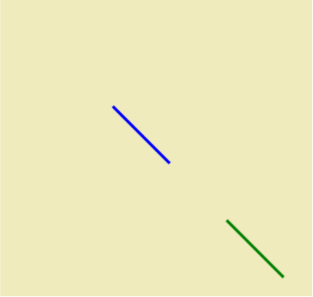
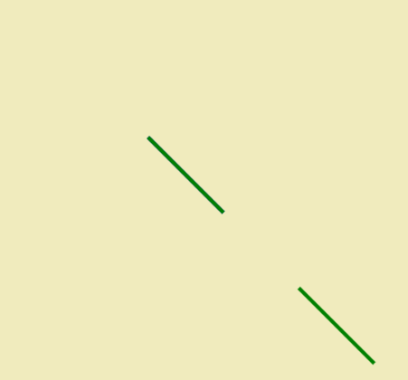
:::

### 封闭与填充
(closePath,fill)

`closePath`能够自动封闭图形，`fill`能够填充图形。
``` js
// 2.简单的：封闭与填充
ctx.beginPath();
ctx.moveTo(100, 100);
ctx.lineTo(150, 150);
ctx.lineTo(100, 150);
// ctx.closePath(); // 自动闭合封闭图形（相当于lineTo起点）
ctx.fillStyle = 'red'; // fillStyle要写在fill()前，才有效
ctx.fill();
// 会继续使用上面的5像素宽，绿色画笔
// ctx.lineWidth = 5; 
// ctx.strokeStyle = 'green';
ctx.stroke();
```
::: details 代码运行演示：第一张使用closePath，第二张没有
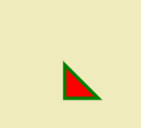  
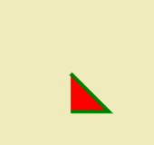
:::

### 绘制矩形与restore恢复
(rect，fillRect，strokeRect，restore)

`rect`：绘制矩形，需要stroke;

`fillRect`：绘制填充矩形，不需要stroke;

`strokeRect`：绘制矩形边框，不需要stroke;

`restore`：恢复画面设置，配合`save`（在[上面](#笔画绘制动作与划分)的实例代码中有使用）
``` js
// 3.绘制矩形，restore恢复
ctx.restore();  // 可以看到这里绘制蓝色矩形而不是绿色，就是restore的效果
ctx.beginPath();
ctx.rect(200, 100, 100, 50); // 绘制矩形api
ctx.stroke();
ctx.fillStyle = 'blue'
ctx.fillRect(300, 100, 100, 50); // 绘制填充矩形api，不需要stroke
ctx.strokeRect(400, 100, 100, 50); // 绘制矩形api，同样不需要再补充stroke
```
::: details 代码运行演示：绘制矩形与restore恢复
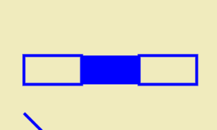
:::

### 绘制圆弧
(arcTo,arc)

日常使用绘制圆形基本会使用`arc`方法，`arcTo`则是用于绘制比如圆角矩形的圆角这些自由度更高的场景。

``` js
// 4.绘制圆弧，不推荐4.1arcTo，更推荐4.2arc
// 4.1 atcTo，先moveTo起点，arcTo(x1,y1,x2,y2,R);
// 根据起点与x1,y1连线，x1,y1与x2,y2连线，做内切圆，半径由R决定
// 并且最终起点还会与圆弧一端相连--->这意味着不只是圆弧，如果只想要圆弧，就得让起点为切点
ctx.beginPath();
ctx.moveTo(100, 500);
ctx.arcTo(100, 600, 0, 500, 100);
ctx.stroke();

// 4.2 arc，前两个参数为圆心坐标，然后是半径，起始角度，结束角度，绘制的顺逆时针(默认为false顺，输入true为逆)
ctx.beginPath();
ctx.arc(200, 500, 100, 0, Math.PI / 4);
ctx.stroke();
ctx.beginPath();
ctx.arc(300, 500, 100, 0, Math.PI / 4, true);
ctx.stroke();
```
::: details 代码运行演示：第一张使用arcTo，圆弧与起点相连；第二张arc顺时针，第三张arc逆时针
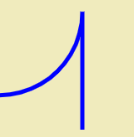  
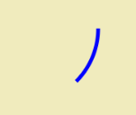  
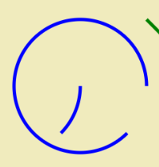
:::
### 贝塞尔曲线
(quadraticCurveTo，bezierCurveTo)

`quadraticCurveTo`：绘制二次贝塞尔曲线

`bezierCurveTo`：绘制三次贝塞尔曲线

**贝塞尔曲线这部分可能不太重要，arc和arcTo足够应用大部分场景**

``` js
// 5.贝塞尔曲线绘制任意弧线
// 5.1 二阶(当前点起点，quadraticCurveTo中传入控制点坐标+另一个参照点坐标)
// 原理是点1到控制点连线，控制点到点2连线，两线各取相同比例位置连线，
// 比如中点连接中点，同理各个点按比例互连得到很多新的线，从中取点连成弧线
ctx.save();
// 标记三个点（可忽略）
ctx.beginPath();
ctx.fillStyle = 'red';
ctx.arc(600, 100, 5, 0, Math.PI * 2);
ctx.fill();
ctx.beginPath();
ctx.arc(700, 0, 5, 0, Math.PI * 2);
ctx.fill();
ctx.beginPath();
ctx.arc(750, 200, 5, 0, Math.PI * 2);
ctx.fill();
ctx.beginPath();
// 绘制贝塞尔曲线
ctx.restore();
ctx.moveTo(600, 100);
ctx.quadraticCurveTo(700, 0, 750, 200);
ctx.stroke();

// 5.2 三阶，增加一个控制点
// 原理则是在二阶基础上叠加一层，因为多了一个控制点，
// 这次初始可以画出三条线了，那么三条线按照比例找点连接，
// 左连中，中连右，可以得到两条线，
// 这两条线仍然照相同比例找点连接，得到最后一条线，
// 重复，找点，得到曲线
ctx.save();
// 标记四个点（可忽略）
ctx.beginPath();
ctx.fillStyle = 'red';
ctx.arc(600, 300, 5, 0, Math.PI * 2);
ctx.fill();
ctx.beginPath();
ctx.arc(700, 200, 5, 0, Math.PI * 2);
ctx.fill();
ctx.beginPath();
ctx.arc(750, 400, 5, 0, Math.PI * 2);
ctx.fill();
ctx.beginPath();
ctx.arc(600, 400, 5, 0, Math.PI * 2);
ctx.fill();
ctx.beginPath();
// 绘制贝塞尔曲线
ctx.restore();
ctx.moveTo(600, 300);
ctx.bezierCurveTo(700, 200, 750, 400, 600, 400);
ctx.stroke();
```
::: details 代码运行演示：第一张使用quadraticCurveTo绘制二次贝塞尔曲线，第二张使用bezierCurveTo绘制三次贝塞尔曲线
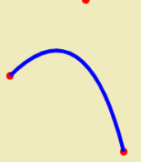  
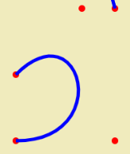
:::

### 线段样式
(lineWidth,stroke，lineCap，lineJoin,setLineDash)

`lineCap`是<span style="color:green;">**白板功能中常用的设置**</span>，它能够使线段的端点样式更加美观。同时搭配的还有lineJoin，它能够使线段的连接点更加更加美观。

`lineWidth`：线段宽度

`stroke`：线段颜色

`lineCap`：线段端点样式

`lineJoin`：线段连接点样式

`setLineDash`：设置线段虚线样式

``` js
ctx.beginPath();
ctx.lineWidth = 5;
ctx.lineJoin = 'round'; // 圆帽子，默认则是方形（手绘常用圆）
ctx.lineCap = 'round'; // 圆帽子，默认则是方形（手绘常用圆）
ctx.strokeStyle = 'black';
ctx.moveTo(600, 450);
ctx.lineTo(700, 450);
ctx.stroke();

ctx.beginPath();
ctx.setLineDash([5, 10]) // 虚线，数组可以传入多个，一般两个，美观
// 表示第一个线段，第一个空格，(第二个线段)...循环
ctx.moveTo(600, 500);
ctx.lineTo(700, 500);
ctx.stroke();
```
::: details 代码运行演示：线段样式
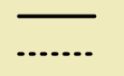  
:::

### 渐变
(linearGradient,radialGradient)

`linearGradient`：线性渐变

`radialGradient`：径向渐变

``` js
// 7.渐变
// 7.1 线性渐变
ctx.beginPath();
let gradient = ctx.createLinearGradient(600, 600, 800, 800); // 注意这里变坐标系是直接按坐标系来
// 不是参照的意思，必须填600->800，和下面绘制矩形严格一致
gradient.addColorStop(0, 'white');
gradient.addColorStop(1, 'aqua');
ctx.fillStyle = gradient;
ctx.fillRect(600, 600, 200, 200);

// 7.2径向渐变
ctx.beginPath();
let gradient2 = ctx.createRadialGradient(600, 900, 20, 600, 900, 100); //圆心1坐标+半径；圆心2坐标+半径
gradient2.addColorStop(0, 'white');
gradient2.addColorStop(1, 'aqua');
ctx.fillStyle = gradient2;
ctx.fillRect(550, 850, 100, 100);
```
::: details 代码运行演示：线性渐变和径向渐变
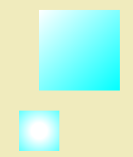
:::

### 纹理样式/文字/绘制图片
(createPattern,fillText,drawImage)

`createPattern`：创建纹理样式，配合fillStyle使用

`fillText`：绘制文字

`drawImage`：绘制图片，<span style="color:green;">**使用绘制图片功能时，我们会意识到图片的加载是异步的，所以需要使用Image对象的src属性，设置图片路径，然后在onload事件中绘制图片，确保图片加载完成后后再绘制（异步操作）**</span>

``` js
// 8.纹理样式+文字+绘制图片
ctx.save();
let img = new Image();
img.src = './wall.png';
// 文字属性
ctx.font = '44px MicroSoft Yahei'; // 必须要有字体
ctx.shadowOffsetX = 2;
ctx.shadowOffsetY = 2;
ctx.shadowBlur = 2;
ctx.shadowColor = "rgba(255,0,0,.5)"
img.onload = function () { // 这里必须要onload触发 -> 图片加载是异步操作
    let pattern = ctx.createPattern(img, 'repeat'); // pattern纹理样式
    ctx.fillStyle = pattern;
    ctx.fillRect(0, 600, 300, 100);
    ctx.fillText('你好', 10, 750, 100);
    ctx.restore();
};
// 绘制图片
let img2 = new Image();
img2.src = './windows.jpg';
img2.onload = function () {
    // 参数第一个是图像
    // ctx.drawImage(img2, 0, 0); // 绘制坐标
    ctx.drawImage(img2, 0, 800, 332, 216); // 绘制坐标 + 图片宽高
    ctx.drawImage(img2, 800, 400, 332, 216, 0, 1100, 332, 216); // 裁剪坐+ 裁剪大小(宽高) + 绘制坐标 + 图片宽高
};
```
::: details 代码运行演示：纹理样式+文字+绘制图片
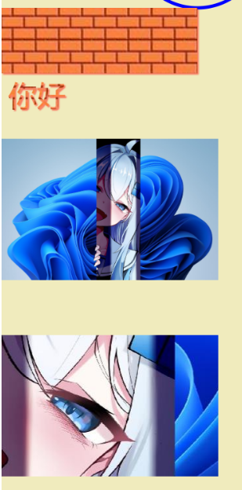
:::

### 坐标系变换(常规与transform缩写)
(translate,rotate,scale,transform)

`translate`：平移坐标系

`rotate`：旋转坐标系

`scale`：缩放坐标系

`transform`：综合变换，可以说是缩写；

<span style="color:green;">**注意六个参数顺序，可以记得100100是标准不变；其中：**</span>
- 两个1是水平与垂直缩放；
- 前两个零是旋转角度，水平顺时针旋转，垂直逆时针旋转，所以如果只是打算坐标系旋转而不扭曲，那么水平和垂直的旋转角度应该设为相反数；
- 最后两个零是平移坐标，分别表示水平平移和垂直平移；

``` js
// 9.坐标系变换，常规+transform缩写
// 平移
ctx.save()
ctx.beginPath();
ctx.translate(800, 800);
ctx.fillRect(0, 0, 100, 100);
ctx.restore()
// transform实现
ctx.save()
ctx.beginPath();
ctx.transform(1, 0, 0, 1, 900, 800) // 六个参数，水平缩放1，水平倾斜；垂直倾斜，缩放1；水平位移，垂直位移；
ctx.fillRect(0, 0, 100, 100);
ctx.restore()

// 旋转
ctx.save()
ctx.beginPath();
ctx.rotate(1); // 2 * Math.PI是一圈
ctx.fillStyle = 'white';
ctx.fillRect(1200, 0, 300, 100);
ctx.restore()

// transform实现(奇怪的倾斜效果，x轴顺时针旋转，y轴逆时针，所以参数需要一正一负实现rotate旋转)
ctx.save()
ctx.beginPath();
ctx.transform(1, 0.1, -0.1, 1, 0, 0) // 六个参数，水平缩放1，倾斜；垂直倾斜，缩放1；水平位移，垂直位移；
ctx.fillStyle = 'black';
ctx.fillRect(1000, 0, 300, 100);
ctx.restore()

// 缩放
ctx.save()
ctx.fillStyle = 'aquamarine';
ctx.scale(.5, .5);
ctx.fillRect(2000, 1200, 100, 100);
ctx.restore()
// transform实现
ctx.save()
ctx.fillStyle = 'aquamarine';
ctx.transform(0.5, 0, 0, 0.5, 0, 0)
ctx.fillRect(2000, 1400, 100, 100);
ctx.restore()
```
::: details 代码运行演示：坐标系变换，第一张使用translate(蓝色平移，白色旋转，青色缩放)，第二张使用transform缩写(蓝色平移，黑色旋转，青色缩放)
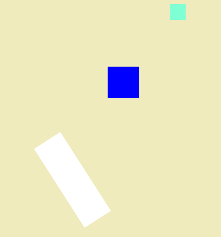  
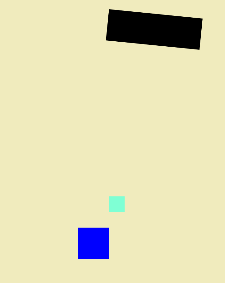
:::

## canvas的实例应用
(clip,globalCompositeOperation)

下面讲一讲canvas的实例应用，包括放大镜、刮刮乐、简单的白板实现等。也会涉及上面刚刚没有讲到的一些api

### 放大镜实现
`clip`：裁剪路径，只绘制裁剪路径内的内容

设计思路：两个canvas，存放一张一倍图和二倍图；获取坐标，计算二倍图对应位置，drawImage在二倍图上截取相同大小内容，展示在clip裁剪的相同大小区域，看起来就是放大了

``` js
<div class="container">
    <h1>放大镜(按住放大)</h1>
    <canvas id="canvas" width="664" height="432"></canvas>
    <canvas id="canvas2" width="1328" height="864"></canvas>
</div>
<script>
    /** @type {HTMLCanvasElement} */
    const can = document.getElementById("canvas");
    const can2 = document.getElementById("canvas2");
    const ctx = can.getContext("2d");
    const ctx2 = can2.getContext("2d");
    let signal = false;
    let wid = 664;
    let hei = 432;
    let MagR = 50; // 放大镜半径
    const img = new Image();
    img.src = './windows.jpg';
    img.onload = function () {
        ctx.drawImage(img, 0, 0, wid, hei); // 2倍大小关系
        ctx2.drawImage(img, 0, 0, wid * 2, hei * 2)
    }
    can.addEventListener('mousedown', (e) => {
        console.log('放大', e.offsetX, e.offsetY);
        signal = true;
        bigger(e.offsetX, e.offsetY);
    })
    can.addEventListener('mousemove', (e) => {
        if (!signal) return;
        ctx.clearRect(0, 0, wid, hei);
        ctx.drawImage(img, 0, 0, wid, hei);
        bigger(e.offsetX, e.offsetY);
    })
    can.addEventListener('mouseup', (e) => {
        signal = false;
        ctx.clearRect(0, 0, wid, hei);
        ctx.drawImage(img, 0, 0, wid, hei);
    })
    can.addEventListener('mouseout', (e) => {
        signal = false;
        ctx.clearRect(0, 0, wid, hei);
        ctx.drawImage(img, 0, 0, wid, hei);
    })
    const bigger = (x, y) => {
        ctx.save();
        ctx.lineWidth = 5;
        ctx.strokeStyle = 'black';
        ctx.beginPath();
        ctx.arc(x, y, MagR, 0, Math.PI * 2);
        ctx.stroke();
        ctx.clip();
        // ctx.drawImage(can2, x * 2 - MagR, y * 2 - MagR, MagR * 2, MagR * 2, x - MagR, y - MagR, MagR * 2, MagR * 2);
        ctx.drawImage(can2, x * 2 - MagR, y * 2 - MagR, 300, 300, x - MagR, y - MagR, 300, 300);
        // ctx.drawImage(can, x - 15, y - 15, 30, 30, x - 30, y - 30, 60, 60);  // 用一倍图can等比放大--模糊
        // 也更直观体现了放大原理，裁剪图片，到对应区域展示；
        // 即使同一张图，裁切30*30的内容，展示在60*60，也是放大，但比较模糊。体现了二倍图的意义----更清晰
        ctx.restore();
    }
</script>
```
::: details 代码运行演示：放大镜动图演示
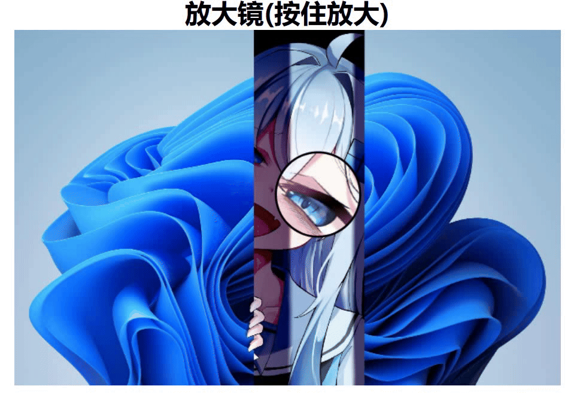
:::
#### <span style="color:green;">**重点：**</span>
1.放大的核心手段就是<span style="color:green;">**drawImage裁切对应区域内容，展示在对应大小区域**</span>

比如从二倍图切出`60*60`的内容，在一倍图`60*60`的区域展示，就是放大效果；同样的道理，其实从同一张一倍图，裁切`30*30`的内容，展示在`60*60`，也是放大；

2.二倍图的意义在于<span style="color:green;">**更加清晰**</span>；

3.理解`clip`裁切的意思就是<span style="color:green;">**划出前面绘制的区域，后续绘制内容只显示在裁切区域中**</span>

即使后续绘制一整幅画，也只会显示裁切部分内容；比如在clip的作用下，下面两行代码是没有区别的，因为最后都会被裁切：
``` js
ctx.drawImage(can2, x * 2 - 30, y * 2 - 30, 60, 60, x - 30, y - 30, 60, 60);
ctx.drawImage(can2, x * 2 - 30, y * 2 - 30, 300, 300, x - 30, y - 30, 300, 300);
```
当然60,60就是刚刚好的放大，300,300则有些多余

### 刮刮乐实现
`globalCompositeOperation`：复合操作，有非常多操作，具体可以去参考w3school。这里刮刮乐使用的是destination-out。

核心思路：<span style="color:green;">**destination-out能够让canvas画面互相抵消露出最底层，即使用蓝色画笔刮开，看到的也是底层的白色**</span>

``` js
<head>
    <meta charset="UTF-8">
    <meta name="viewport" content="width=device-width, initial-scale=1.0">
    <title>刮刮乐</title>
    <style>
        .container {
            width: 600px;
            margin: 0 auto;
        }

        h1 {
            position: absolute;
            top: 50%;
            left: 50%;
        }

        #canvas {
            position: absolute;
        }
    </style>
</head>

<body>
    <div class="container">
        <h1>特等奖</h1>
        <canvas id="canvas" width="600" height="1000"></canvas>
    </div>
    <script>
        /** @type {HTMLCanvasElement} */
        const can = document.getElementById("canvas");
        const ctx = can.getContext("2d");
        let isScratch = false;
        let startX = 0;
        let startY = 0;
        ctx.fillStyle = 'brown';
        ctx.fillRect(0, 0, 600, 1000);
        // ctx.beginPath();
        // ctx.font = "44px Microsoft Yahei";
        // ctx.fillStyle = "red";
        // ctx.fillText('特等奖', 250, 550)
        ctx.beginPath();
        ctx.moveTo(120, 400) // 100+20半径
        ctx.arcTo(500, 400, 500, 700, 20);
        ctx.arcTo(500, 700, 100, 700, 20);
        ctx.arcTo(100, 700, 100, 400, 20);
        ctx.arcTo(100, 400, 500, 400, 20);
        ctx.fillStyle = "gray";
        ctx.fill()

        ctx.lineCap = "round";
        ctx.strokeStyle = "blue"; // 这里使用蓝色画笔，刮涂后仍然是白色，说明露出的是底层
        ctx.lineWidth = 15;
        can.addEventListener('mousedown', (e) => {
            if (e.offsetX > 500 || e.offsetX < 100 || e.offsetY > 700 || e.offsetY < 400) return;
            isScratch = true;
            ctx.beginPath();
            ctx.moveTo(e.offsetX, e.offsetY);
        })
        can.addEventListener('mousemove', (e) => {
            if (e.offsetX > 500 || e.offsetX < 100 || e.offsetY > 700 || e.offsetY < 400) isScratch = false;
            if (!isScratch) return;
            ctx.globalCompositeOperation = "destination-out";
            ctx.lineTo(e.offsetX, e.offsetY);
            ctx.stroke();
        })
        can.addEventListener('mouseup', () => {
            isScratch = false;
        })
    </script>
</body>
```
::: details 代码运行演示：刮刮乐实现
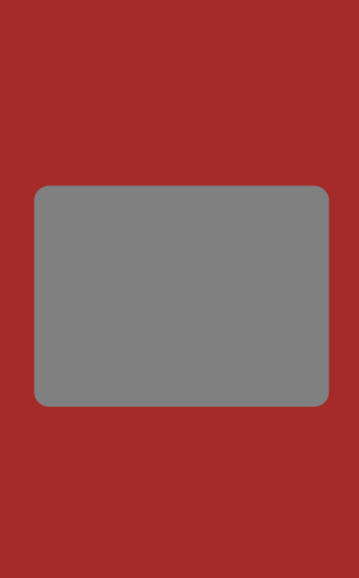
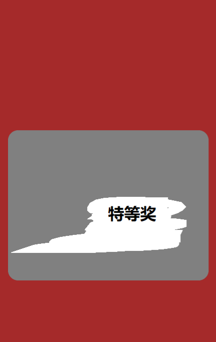
:::
<span style="color:green;">**注意点：因为露出底层，所以特等奖不是canvas绘制内容；特等奖是div，通过position定位到中间，那么canvas当然也需要补充absolute定位来盖在上面**</span>

### 简单的白板实现
这里只实现一个手绘白板的简易效果，不需要多复杂的知识和功能，所以其实是最简单的初级项目；基本上直到lineTo，stroke就能做了😄

核心思路：给画布添加鼠标事件监听，按下时开始绘制，鼠标抬起或离开画布结束；那么<span style="color:green;">**按下时moveTo起点，设置一个绘制状态为true；移动时，如果绘制状态为true，就lineTo当前点；抬起或离开画布时，设置绘制状态为false；**</span>


``` js
<canvas id="canvas" width="1600" height="1000"></canvas>
<script>
    /** @type {HTMLCanvasElement} */
    const can = document.getElementById('canvas');
    const ctx = can.getContext('2d');
    ctx.lineWidth = 5;
    ctx.lineCap = 'round';
    let isDrawing = false;
    let startX = 0;
    let startY = 0;
    can.addEventListener('mousedown', (e) => {
        isDrawing = true;
        ctx.beginPath();
        ctx.moveTo(e.offsetX, e.offsetY);
    });
    can.addEventListener('mouseup', (e) => {
        isDrawing = false;
    });
    can.addEventListener('mouseout', (e) => {
        isDrawing = false;
    });
    can.addEventListener('mousemove', (e) => {
        if (!isDrawing) return;
        draw(e.offsetX, e.offsetY);
    })
    const draw = (newX, newY) => {
        ctx.lineTo(newX, newY);
        ctx.stroke();
    }
</script>
```
::: details 代码运行演示：简单白板动态演示
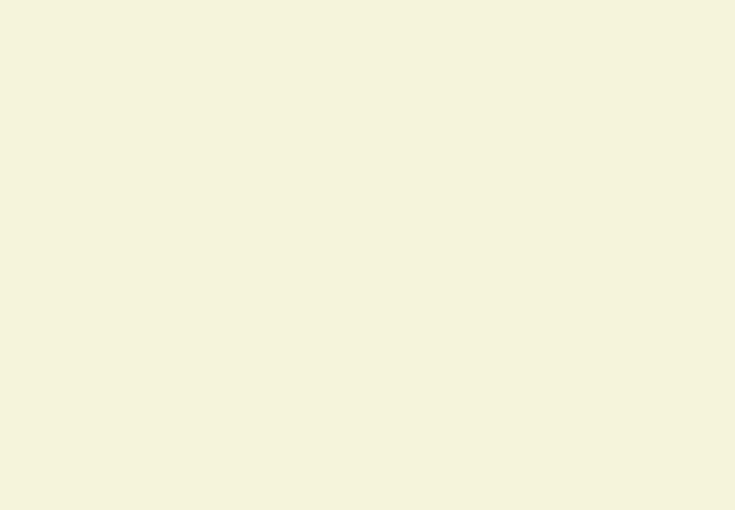
:::

<span style="color:green;">**对比：我看过有其他人的实现是没有使用moveTo，而是设置一个startX，startY，移动时每次直接lineTo当前点，并更新startX，startY，但这样实现的绘制效果是不连续，而且不如我的实现简单，因此这里只记录我的实现代码和方案**</span>