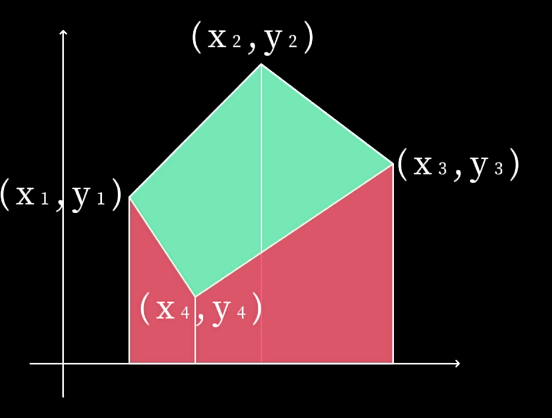
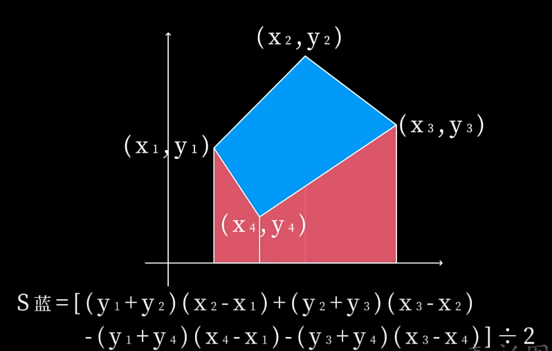
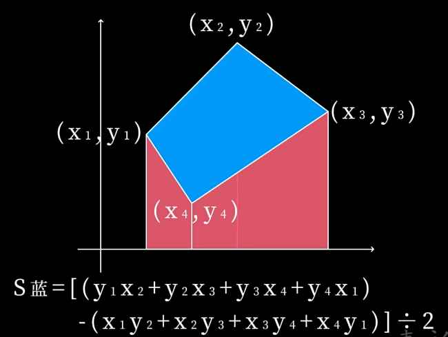

# 白板项目

基础知识学习介绍完毕，终于到了讲解项目的阶段。

## 项目设计

首先讲一下项目设计，要设计一个会议白板，实现一个即时会议，不需要下载、注册、登录等，总体的框架上只需要一个进入会议的页面(首页)，以及会议室页面。

- 进入会议的页面，则分为创建会议/加入会议两种情况。
  - 创建会议：用户点击创建会议按钮，即可创建会议。（创建会议会自动生成一个会议码，用户可以将会议码分享给其他用户。）
  - 加入会议：用户需要输入会议码，点击加入会议按钮，即可加入会议。

- 会议室页面，则主要围绕会议白板展开；
    - 实时协作白板，支持多人同时绘制
    - 支持画笔、橡皮、文本、矩形、圆形、菱形、箭头等工具
    - 图形美化功能，自动识别和美化手绘图形
    - 语音转写功能，使用讯飞星火 API 实现实时语音转写
    - 会议摘要生成功能，基于白板内容和语音转写结果生成会议摘要
    - 文本输入功能：
      - 支持画布上直接生成文本框
      - 文本框大小调整和位置拖动
      - 文本自动换行，支持垂直排列
      - Enter键或确认按钮确认绘制
    - 会议室自动清理机制，基于最后活动时间清理无人使用的会议室

## 项目实现

围绕项目结构与设计功能，我们划分为以下几个模块进行讲解：
- 首页基础功能(会议创建与加入，请求/操作成功失败的消息提示)
- 会议页基础功能(连接开始会议，断开连接离开会议，会议室自动清理功能)
- 实时协作功能(websocket信息传输实现多人共享)
- 白板功能(绘制与图形美化功能,文本输入功能)
- 语音转写字幕功能
- 会议摘要生成功能

## 首页基础功能

先讲一讲基础功能，即会议创建与加入，请求/操作成功失败的消息提示。

### 首页前端实现

**页面结构与设计**

首页其实就是整个项目的页面展示，后面讲的白板页面其实就是一个`component`组件，由`v-if`指令来控制显示隐藏。因为页面结构组成简单，所以包括请求/操作成功失败的消息提示也只需要用`v-if`指令控制显隐的`div`即可实现；
```js
<!-- 会议室管理界面 -->
<div v-if="!isInMeeting" class="meeting-management">
    ...
    <div v-if="errorMessage" class="error-message">
      {{ errorMessage }}
    </div>
    <div v-if="successMessage" class="success-message">
      {{ successMessage }}
    </div>
</div>
<!-- 白板界面 -->
<div v-else class="whiteboard-container">
    ...
</div>
```
**会议基础功能**：

创建会议按钮，直接触发对应方法发送请求，获取会议码，进入会议室；

加入会议按钮，触发对应方法，依靠v-model绑定输入框，获取会议码发送请求，根据请求结果加入会议室/提示错误；<span style="color: green;">**需要注意的是，首页部分并没有真正的加入会议室**</span>，加入会议室开始会议是涉及到`websocket`连接的，项目设计中加入会议室是进入[会议室页面](#会议页前端实现)后才进行的连接操作，首页进行的操作其实只有校验会议室代码是否存在，决定是否进入会议室页面，仅此而已；因此这里发送请求只要发送会议室代码给后台检测一下是否有这个会议室即可。

因为非常简单，只是发送一些请求，所以这里就不贴出代码了。


### 首页后端实现
主要实现以下功能：
- 生成唯一的会议室代码
- 创建会议室
- 加入会议室

**唯一代码与创建会议室**

创建一个会议室管理类，用于管理所有的会议室。每个会议室都有一个唯一的会议室代码，用于标识会议室。

通过`map`来存储所有的会议室，键为会议室代码，值为会议室对象。生成唯一会议室代码时，检测`map`来确保唯一性；创建会议室的api就是调用这个方法，生成一个`code`，然后创建一个会议室对象(包含会议室代码、创建时间、最后活动时间、成员列表、画布状态、图形美化状态)，最后将会议室对象存储到`map`中，返回`code`给前端；
```js
class MeetingRoomManager {
  constructor() {
    this.rooms = new Map();
  }
  generateRoomCode() {
    let code;
    do {
      const length = Math.floor(Math.random() * 3) + 4;
      code = '';
      for (let i = 0; i < length; i++) {
        code += Math.floor(Math.random() * 10);
      }
    } while (this.rooms.has(code));
    return code;
  }
  createRoom() {
    const code = this.generateRoomCode();
    const room = {
      code,
      createdAt: new Date(),
      lastActivityTime: new Date(),
      members: [],
      canvasState: [],
      beautifyState: null
    };
    this.rooms.set(code, room);
    return room;
  }
  getRoom(code) {
    return this.rooms.get(code);
  }
  joinRoom(code, socketId) {
    let room = this.rooms.get(code);
    if (!room || room.members.length === 0) {
      room = {
        code,
        createdAt: new Date(),
        lastActivityTime: new Date(),
        members: [],
        canvasState: [],
        beautifyState: null
      };
      this.rooms.set(code, room);
    }
    const exist = room.members.find(m => m.socketId === socketId);
    if (exist) return room;
    room.members.push({
      id: `user_${Date.now()}`,
      socketId,
      joinedAt: new Date(),
      nickname: `用户${Math.floor(Math.random() * 1000)}`
    });
    return room;
  }
  ...
}

// 创建会议API端点
app.post('/api/create-meeting', (req, res) => {
  try {
    const room = meetingRoomManager.createRoom();
    res.json({ success: true, roomCode: room.code });
  } catch (e) {
    res.status(500).json({ success: false, error: e.message });
  }
});
```
**加入会议室**

<span style="color: green;">**需要注意的是，首页部分并没有真正的加入会议室**</span>，加入会议室，开始会议是涉及到`websocket`连接的，项目设计中加入会议室是进入[会议室页面](#会议页前端实现)后才进行的连接操作，首页进行的操作其实只有校验会议室代码是否存在，决定是否进入会议室页面，仅此而已；api接口也只需要从`map`中get一下是否有请求时发送过来的会议室代码即可。

```js
class MeetingRoomManager {
    ...
    // 获取会议室
    getRoom(code) {
        return this.rooms.get(code);
    }
    ...
}

// 加入会议API端点
app.post('/api/join-meeting', (req, res) => {
  try {
    const { roomCode } = req.body;
    if (!roomCode) {
      return res.status(400).json({ success: false, error: '缺少roomCode' });
    }
    const room = meetingRoomManager.getRoom(roomCode);
    if (!room) {
      return res.status(404).json({ success: false, error: '会议室不存在' });
    }
    res.json({ success: true, roomCode });
  } catch (e) {
    res.status(500).json({ success: false, error: e.message });
  }
});
```

## 会议页基础功能

继续讲会议页的基础功能，主要如下：
- 进入会议室(websocket连接)
- 离开会议室(websocket断开连接)
- 清理无人或长时间无活动的会议室

### 会议页基础功能前端实现
**进入会议室**

之前已经讲过，会议页是一个组件，由`v-if`指令来控制显示隐藏。当用户创建/加入会议室成功(会议室代码存在)，这个组件被显示出来，传入会议室代码作为props，在组件生命周期钩子中添加对应的连接逻辑(创建websocket连接，并做数据处理)
```js
export default {
  name: 'Whiteboard',
  props: {
    roomCode: {
      type: String,
      required: true
    }
  },
  data() {
    return {
      ...
    }
  },
  mounted() {
    this.canvas = this.$refs.canvas;
    this.ctx = this.canvas.getContext('2d');
    this.setupCanvas();
    this.setupWebSocket();
  },
  beforeUnmount() {
    // 组件销毁时关闭 WebSocket 连接
    this.closeWebSocket();
  },
  ...
  methods: {
    setupCanvas() {
      this.ctx.lineCap = 'round';
      this.ctx.lineJoin = 'round';
      this.ctx.strokeStyle = this.color;
      this.ctx.lineWidth = this.lineWidth;
    },
    setupWebSocket() {
      try {
        // 使用传入的roomCode建立WebSocket连接
        console.log(`与会议室${this.roomCode}建立WebSocket连接`);
        this.socket = new WebSocket(`ws://192.168.118.168:8080?roomCode=${this.roomCode}`);

        this.socket.onopen = () => {
          console.log(`与会议室${this.roomCode}的WebSocket连接成功，readyState: ${this.socket.readyState}`);
          // 发送昵称信息到服务器
          this.sendWebSocketMessage('更新昵称', { nickname: this.nickname });
        };

        this.socket.onmessage = (event) => {
          ...数据处理逻辑
        };
        this.socket.onclose = () => {
          console.log(`WebSocket 已断开连接，会议室: ${this.roomCode}`);
        };

        this.socket.onerror = (error) => {
          console.error(`WebSocket 错误: ${error}`);
        };
      } catch (error) {
        console.error(`设置WebSocket连接时出错: ${error}`);
      }
    }
  }
}
```

**离开会议室，为清理会议室提供支持**

同理，离开会议室时需要断开连接，我们提供了离开会议的按钮，同时在组件的生命周期钩子中添加对应的断开连接逻辑(这个在[上面](#会议页前端实现)已经展示过)，这样的操作能够即使用户不点击离开会议按钮，也能及时断开与服务器的连接(这对于多人会议的消息传递，以及清理会议室的功能很重要)。

当然这里因为创建/加入会议都在父组件中实现，并且希望白板功能划分明确，离开会议的功能在父组件中实现，也就是首页，但是因为这是在进入会议后(进入会议页)的功能，又涉及到`websocket`连接，所以还是写到这里：

下面是父组件离开会议的代码：直接调整信号关闭组件，组件的卸载生命周期钩子会关闭websocket连接。
```js
leaveMeeting() {
  this.isInMeeting = false
  this.currentRoomCode = ''
  this.roomCode = ''
  console.log('离开会议成功');
}
```


### 会议页基础功能后端实现

下面来看代码，websocket连接直接挂钩的就是`进入会议室`和`离开会议室`功能；

**进入会议室**

```js
// WebSocket
server.on('upgrade', (req, socket, head) => {
  const url = new URL(req.url, `http://${req.headers.host}`);
  const roomCode = url.searchParams.get('roomCode');
  if (!roomCode) {
    socket.destroy();
    return;
  }
  wss.handleUpgrade(req, socket, head, (ws) => {
    wss.emit('connection', ws, req, roomCode);
  });
});

wss.on('connection', (ws, req, roomCode) => {
  ws.id = `socket_${Date.now()}`;
  ws.roomCode = roomCode;
  meetingRoomManager.joinRoom(roomCode, ws.id);
  clients.push(ws);

  ws.send(JSON.stringify({
    type: 'canvasState',
    data: meetingRoomManager.getCanvasState(roomCode)
  }));
  ws.send(JSON.stringify({
    type: 'socketId',
    data: ws.id
  }));
  ...
});
```

这里我们监听upgrade事件；和之前直接监听connection事件不同，这是因为我们需要在握手前验证参数(会议室代码roomCode)是否存在，若不存在，`socket.destroy();`销毁连接。因此我们会需要一个握手前的“生命周期钩子”upgrade事件，来实现这里的校验；
``` js
server.on('upgrade', (req, socket, head) => {
  const url = new URL(req.url, `http://${req.headers.host}`);
  const roomCode = url.searchParams.get('roomCode');
  if (!roomCode) {
    socket.destroy();
    return;
  }
  ...
});
```
校验逻辑处理完毕了，那么接下来就是握手，仍然是使用监听connection事件来实现，**用handleUpgrade方法触发connection事件**。
``` js
wss.handleUpgrade(req, socket, head, (ws) => {
  wss.emit('connection', ws, req, roomCode);
});
```
<span style="color:green;">**简而言之，只是采用`upgrade`事件在握手前做一些校验，如果校验成功，才用`handleUpgrade`方法去触发`connection`事件；失败就销毁连接。**</span>

继续下面的内容，握手连接成功后，需要给每个用户(socket)分配id，这便于后续的消息传递。
``` js
// 为socket分配唯一ID
ws.id = `socket_${Date.now()}`;
ws.roomCode = roomCode;
meetingRoomManager.joinRoom(roomCode, ws.id);
clients.push(ws);
```
加入会议室的joinRoom之前没有展示，但是也很简单，逻辑上就是需要的话(无房间/旧空房间)新建房间，设置房间属性(创建时间，成员列表等)；创建成员，设置成员属性(昵称，加入时间等)，添加进房间成员列表，最后返回房间，很简单的常规代码，这里就不展示了；

可以看到按照上面的流程，我们就完成了**进入会议室**的功能；这里顺便讲一讲进入会议室后顺带会做的内容：**进入会议室后需要获取当前的白板内容，保障后进入会议的成员能够看到之前的白板内容**(至于这里用来发送传递的画布状态等信息是怎么处理的，在[后面](#)我们再讲解)，同时，**刚刚分配的socketId也需要发送给客户端**，方便后续的消息传递。
``` js
ws.send(JSON.stringify({
  type: 'canvasState',
  data: meetingRoomManager.getCanvasState(roomCode)
}));
ws.send(JSON.stringify({
  type: 'socketId',
  data: ws.id
}));
```

**离开与清空会议室**

最后我们来讲解一下离开会议室的功能：这部分功能很简单，其实就是前端关闭websocket连接，后端也需要清理对应的连接内容，包括语音，调用leaveRoom(减少房间成员数，移除成员，更新房间属性，为0则移除该房间)，和joinRoom一样很简单常规，这里就不展示了。
```js
wss.on('connection', (ws, req, roomCode) => {
  ...
  ws.on('close', () => {
    speechService?.close();
    meetingRoomManager.leaveRoom(ws.roomCode, ws.id);
    clients = clients.filter(c => c !== ws);
  });
  ws.on('error', () => { });
});
```
关于移除会议室，还做了一个兜底处理：
```js
class MeetingRoomManager {
  ...
  cleanupEmptyRooms() {
    const now = new Date();
    for (const [code, r] of this.rooms.entries()) {
      if (r.members.length === 0 || now - r.lastActivityTime > 10 * 60 * 1000) {
        this.rooms.delete(code);
      }
    }
  }
}
server.listen(PORT, '0.0.0.0', () => {
  console.log(`✅ 服务启动: http://192.168.153.168:${PORT}`);
  setInterval(() => meetingRoomManager.cleanupEmptyRooms(), 5 * 60 * 1000);
});
```
这个方法在服务端启动的位置定时调用，每5分钟调用一次。检查所有房间，如果房间成员数为0，或者最后活动时间超过10分钟，我们就移除该房间。这样能够及时清理空房间，避免资源浪费。

## 白板功能
接下来就是项目核心的白板功能了，这部分有非常丰富的内容，包括：
- 实时协作白板功能
  - 基础功能：画笔，橡皮，文本，形状，颜色，大小等
  - 通过websocket实现共享白板
- 美化白板操作
  - 手绘图形(矩形，圆，菱形，箭头)识别美化，以及对应的撤回实现
  - websocket同步美化与撤回美化

让我们一点一点讲解：

### 实时协作白板基础功能

这部分设计的功能众多，代码也比较多，因此对于每个部分功能分开讲解，分开展示，以便理解和阅读。这部分功能也是直接交由前端实现，因此贴出的代码也都是前端代码。
#### 画笔与橡皮功能
其实画笔功能在[之前的文档](./aboutCanvas#简单的白板实现)已经讲过，不过这里采取的是另一种分段的写法；对于简单的白板绘制确实是那样会更好，但因为我们的项目需求对于每一笔画都需要记录，甚至需要操作(比如美化、撤销等)，因此这里采取分段记录，即起始坐标，结束坐标都做记录并绘制；至于为什么橡皮功能也一起讲解，其实是因为<span style="color:green;">**橡皮功能的实现完全可以用画笔的逻辑来完成，橡皮可以看作是白色的画笔，逻辑复用就能够起到相同的效果**</span>；

首先是常规的canvas画板，监听四个事件处理画笔绘制：同时白板需要工具栏，用于切换不同的画笔工具。
```js
<canvas
  ref="canvas"
  :width="width"
  :height="height"
  @mousedown="startDrawing"
  @mousemove="draw"
  @mouseup="stopDrawing"
  @mouseleave="stopDrawing"
></canvas>
<div class="toolbar">
  <button @click="setTool('pen')" :class="{ active: currentTool === 'pen' }">画笔</button>
  <button @click="setTool('eraser')" :class="{ active: currentTool === 'eraser' }">橡皮</button>
  <button @click="setTool('text')" :class="{ active: currentTool === 'text' }">文本</button>
  <button @click="setTool('mouse')" :class="{ active: currentTool === 'mouse' }">鼠标</button>
  <button @click="setTool('rectangle')" :class="{ active: currentTool === 'rectangle' }">矩形</button>
    <button @click="setTool('circle')" :class="{ active: currentTool === 'circle' }">圆形</button>
    <button @click="setTool('diamond')" :class="{ active: currentTool === 'diamond' }">菱形</button>
    <button @click="setTool('arrow')" :class="{ active: currentTool === 'arrow' }">箭头</button>
    <input type="color" v-model="color" />
    <span>笔画粗细:</span>
    <input type="range" v-model="lineWidth" min="1" max="10" />
    <span>{{ lineWidth }}px</span>
    <span>字体大小:</span>
    <input type="range" v-model="fontSize" min="8" max="48" />
    <span>{{ fontSize }}px</span>
    <button @click="clearCanvas">清空</button>
    <button @click="exportCanvas">导出</button>
    <button @click="toggleSpeechRecognition" :class="{ active: isRecording }">
      {{ isRecording ? '停止录音' : '开始录音' }}
    </button>
    <button @click="beautifyShape">美化图形</button>
    <button @click="undoBeautify" :disabled="!originalElements">撤销美化</button>
    <button @click="generateSummary">生成摘要</button>
    <button @click="printTranscriptionHistory">打印发言内容</button>
  <div class="nickname-container">
    <span v-if="!showNicknameInput">{{ nickname }} <button @click="showNicknameInput = true">修改</button></span>
    <div v-else class="nickname-input">
      <input v-model="nickname" @keyup.enter="saveNickname" @blur="saveNickname" placeholder="输入昵称" />
      <button @click="saveNickname">保存</button>
      <button @click="showNicknameInput = false">取消</button>
    </div>
  </div>
</div>
```
下面是与实现功能相关的方法：

`setTool`方法：是用于标记当前使用的工具，比如画笔，橡皮，文本等，根据选择的工具不同，白板上的处理逻辑也需要相应的变化；

`startDrawing`方法：可以看到我们<span style="color:green;">记录了起始坐标，结束坐标，并且将绘制图形的点都收集起来</span>，这是为了后续的[识别美化功能](#)的实现；在上面的绑定事件中，可以看到该方法绑定监听了`mousedown`事件，这意味着不只是绘制动作，其他在画板上点击开始的动作都会经过这个方法，这也是决定后续执行逻辑的关键，所以也能看到方法内执行一些判断；

可以看到判断确认是我们画笔/橡皮动作时，除了常规的设置一个绘制信号以外，还<span style="color:green">为每一笔分配一个唯一的strokeId，使用socketId作为前缀</span>，这么做也是为了后续识别笔画进行美化，<span style="color:green">**请注意这里的一笔是指一次绘制完成，即一次鼠标按下到抬起，不是lineTo的意思；同时这里使用独立的socketId来生成唯一的strokeId，(socket和stroke很像但是不一样哈)，是为了区分多个用户各自绘制的内容**</span>

<a id="flag"></a>
`draw`方法：根据开始坐标和当前坐标绘制线段，然后和`startDrawing`方法类似更新坐标(更新起始坐标实现连续绘制)，记录绘制图形点；<span style="color:green;">将绘制内容保存进入`elements`数组，这是后面也经常用到的数组，用于记录画板上绘制的所有内容，可以支持画板内容全部重绘，这是很重要的功能，能够支持很多操作([后面](#图形绘制功能)会讲到)</span>

`stopDrawing`方法：画笔和橡皮都已经在draw方法中逐段保存，因此这里只需要重置绘制信号，设置为false即可；如果是其他图形可能会需要做重绘处理，就放在下面讲解啦
```js
export default {
  ...,
  methods: {
    setTool(tool) {
      this.currentTool = tool;
      this.isDrawing = false;
      this.isAddingText = false;
    },
    startDrawing(e) {
      const rect = this.canvas.getBoundingClientRect();
      this.startX = e.clientX - rect.left;
      this.startY = e.clientY - rect.top;
      this.lastX = this.startX;
      this.lastY = this.startY;
      
      // 清空绘制点数组，准备收集新图形的点
      this.drawingPoints = [{ x: this.startX, y: this.startY }];
      
      if (this.currentTool === 'text' || this.currentTool === 'mouse') {
        // 检查是否点击了调整手柄
        ......
      } else {
        this.isDrawing = true;
        // 为每一笔分配一个唯一的strokeId，使用socketId作为前缀
        this.strokeId++;
        this.currentStrokeId = `${this.socketId}_${this.strokeId}`;
      }
    },
    draw(e) {
      if (!this.isDrawing && !this.isAddingText) return;
      
      const rect = this.canvas.getBoundingClientRect();
      const currentX = e.clientX - rect.left;
      const currentY = e.clientY - rect.top;
      
      // 实时更新结束坐标
      this.lastX = currentX;
      this.lastY = currentY;
      
      if ((this.currentTool === 'text' || this.currentTool === 'mouse') && this.isAddingText) {
        ......
      } else if (this.currentTool === 'pen') {
        this.ctx.strokeStyle = this.color;
        this.ctx.lineWidth = this.lineWidth;
        this.ctx.beginPath();
        this.ctx.moveTo(this.startX, this.startY);
        this.ctx.lineTo(currentX, currentY);
        this.ctx.stroke();
        
        // 保存画笔绘制的内容到elements数组
        const element = {
          type: 'pen',
          startX: this.startX,
          startY: this.startY,
          lastX: currentX,
          lastY: currentY,
          color: this.color,
          lineWidth: this.lineWidth,
          strokeId: this.currentStrokeId
        };
        this.elements.push(element);
        
        // 收集绘制点用于图形识别
        this.drawingPoints.push({ x: currentX, y: currentY });
        
        // 发送到服务器
        this.sendWebSocketMessage('draw', element);
        
        // 更新起点坐标，实现连续绘制
        this.startX = currentX;
        this.startY = currentY;
      } else if (this.currentTool === 'eraser') {
        // 橡皮功能：绘制白色线条覆盖原有内容
        this.ctx.strokeStyle = '#ffffff';
        this.ctx.lineWidth = this.lineWidth * 2; // 橡皮宽度是线条的2倍
        this.ctx.beginPath();
        this.ctx.moveTo(this.startX, this.startY);
        this.ctx.lineTo(currentX, currentY);
        this.ctx.stroke();
        
        // 保存橡皮绘制的内容到elements数组
        const element = {
          type: 'eraser',
          startX: this.startX,
          startY: this.startY,
          lastX: currentX,
          lastY: currentY,
          lineWidth: this.lineWidth * 2
        };
        this.elements.push(element);
        
        // 发送到服务器
        this.sendWebSocketMessage('draw', element);
        
        // 更新起点坐标，实现连续擦除
        this.startX = currentX;
        this.startY = currentY;
      } else if (this.currentTool === 'rectangle' || this.currentTool === 'circle' || this.currentTool === 'diamond' || this.currentTool === 'arrow') {
        ......
      }
    },
    stopDrawing() {
      if (this.isDrawing) {
        if (this.currentTool === 'pen' || this.currentTool === 'eraser') {
          // 画笔和橡皮都已经在draw方法中逐段保存，不需要额外处理
        } else if (this.currentTool === 'rectangle' || this.currentTool === 'circle' || this.currentTool === 'diamond' || this.currentTool === 'arrow') {
          ......
        }
        this.isDrawing = false;
      } else if (this.isAddingText) {
        ......
      }
    },
    ...
  },
  ...
}
```

#### 图形绘制功能
接下来我们来介绍下图形绘制功能，包括矩形、圆形、菱形、箭头：

设计上是用户点击工具栏上的图形图标，然后在画布上绘制对应的图形。画布上点击确定图形开始位置，<span style="color: green;">拖动改变图形大小</span>，最后松开鼠标绘制完成。也就是确认位置，<span style="color: green;">最后预览确认大小</span>，最后绘制完成。

代码层面，工具栏按钮部分已经在[上面代码](#画笔与橡皮功能)中展示过，这里不再重复；

`startDrawing`方法：与上面画笔与橡皮功能没有差异，不再重复；

`draw`方法：根据用户选择不同图形工具，进行不同的处理：这部分其实涉及到上面提到的预览，随着用户拖动鼠标，我们需要实时更新绘制图形大小，这实现的时候就需要高频重绘来支持，这个时候就体现上面记录画布元素的作用，有元素的坐标与大小信息，能够根据坐标与大小信息来支持重绘图形。

```js
draw(e) {
  if (!this.isDrawing && !this.isAddingText) return;
  
  const rect = this.canvas.getBoundingClientRect();
  const currentX = e.clientX - rect.left;
  const currentY = e.clientY - rect.top;
  
  // 实时更新结束坐标
  this.lastX = currentX;
  this.lastY = currentY;
  
  if ((this.currentTool === 'text' || this.currentTool === 'mouse') && this.isAddingText) {
    ......
  } else if (this.currentTool === 'rectangle' || this.currentTool === 'circle' || this.currentTool === 'diamond' || this.currentTool === 'arrow') {
    // 清空画布并重新绘制所有元素
    this.ctx.clearRect(0, 0, this.width, this.height);
    this.redrawElements();
    
    // 绘制当前图形
    this.ctx.strokeStyle = this.color;
    this.ctx.lineWidth = this.lineWidth;
    
    if (this.currentTool === 'rectangle') {
      this.ctx.beginPath();
      this.ctx.rect(
        Math.min(this.startX, currentX),
        Math.min(this.startY, currentY),
        Math.abs(currentX - this.startX),
        Math.abs(currentY - this.startY)
      );
      this.ctx.stroke();
    } else if (this.currentTool === 'circle') {
      const radius = Math.sqrt(
        Math.pow(currentX - this.startX, 2) + Math.pow(currentY - this.startY, 2)
      );
      this.ctx.beginPath();
      this.ctx.arc(this.startX, this.startY, radius, 0, Math.PI * 2);
      this.ctx.stroke();
    } else if (this.currentTool === 'diamond') {
      const centerX = (this.startX + currentX) / 2;
      const centerY = (this.startY + currentY) / 2;
      const width = Math.abs(currentX - this.startX) / 2;
      const height = Math.abs(currentY - this.startY) / 2;
      
      this.ctx.beginPath();
      this.ctx.moveTo(centerX, centerY - height);
      this.ctx.lineTo(centerX + width, centerY);
      this.ctx.lineTo(centerX, centerY + height);
      this.ctx.lineTo(centerX - width, centerY);
      this.ctx.closePath();
      this.ctx.stroke();
    } else if (this.currentTool === 'arrow') {
      this.ctx.beginPath();
      this.ctx.moveTo(this.startX, this.startY);
      this.ctx.lineTo(currentX, currentY);
      this.ctx.stroke();
      // 绘制箭头
      const angle = Math.atan2(currentY - this.startY, currentX - this.startX);
      const arrowLength = 10;
      this.ctx.beginPath();
      this.ctx.moveTo(currentX, currentY);
      this.ctx.lineTo(
        currentX - arrowLength * Math.cos(angle - Math.PI / 6),
        currentY - arrowLength * Math.sin(angle - Math.PI / 6)
      );
      this.ctx.moveTo(currentX, currentY);
      this.ctx.lineTo(
        currentX - arrowLength * Math.cos(angle + Math.PI / 6),
        currentY - arrowLength * Math.sin(angle + Math.PI / 6)
      );
      this.ctx.stroke();
    }
  }
},
```
接下来得详细讲讲各个图形的绘制实现：

**矩形**:

使用rect方法绘制一个矩形，核心参数是左上角坐标和矩形的宽高；所需的信息很简单，用户点击开始的坐标，和当前用户光标所在坐标；但用户光标所在位置也可能比开始坐标更小，所以需要取最小值作为左上角坐标，宽高则是取二者之差的绝对值；
```js
if (this.currentTool === 'rectangle') {
  this.ctx.beginPath();
  this.ctx.rect(
    Math.min(this.startX, currentX),
    Math.min(this.startY, currentY),
    Math.abs(currentX - this.startX),
    Math.abs(currentY - this.startY)
  );
  this.ctx.stroke();
}
```

**圆形**：

使用arc方法绘制一个圆形，核心参数是圆心坐标和半径；我们以用户点击开始的坐标为圆心，计算当前用户光标所在坐标与起始坐标的距离，得到半径，绘制一个完整的圆；
```js
else if (this.currentTool === 'circle') {
  const radius = Math.sqrt(
    Math.pow(currentX - this.startX, 2) + Math.pow(currentY - this.startY, 2)
  );
  this.ctx.beginPath();
  this.ctx.arc(this.startX, this.startY, radius, 0, Math.PI * 2);
  this.ctx.stroke();
}
```

**菱形**：

使用lineTo方法绘制一个菱形，可以理解为和绘制矩形类似，取矩形四边中点为菱形顶点；计算图形中点，矩形宽高，基于中点计算四个顶点，使用lineTo方法绘制四个顶点的线段即可；
```js
else if (this.currentTool === 'diamond') {
  const centerX = (this.startX + currentX) / 2;
  const centerY = (this.startY + currentY) / 2;
  const width = Math.abs(currentX - this.startX) / 2;
  const height = Math.abs(currentY - this.startY) / 2;
  
  this.ctx.beginPath();
  this.ctx.moveTo(centerX, centerY - height);
  this.ctx.lineTo(centerX + width, centerY);
  this.ctx.lineTo(centerX, centerY + height);
  this.ctx.lineTo(centerX - width, centerY);
  this.ctx.closePath();
  this.ctx.stroke();
}
```

**箭头**：

首先绘制线段，然后根据线段方向绘制箭头，线段方向通过计算当前用户光标所在坐标与起始坐标的角度，得到线段方向：
- Math.atan2(y, x) ：计算从原点到点(x, y)的角度，参数是 (终点Y - 起点Y, 终点X - 起点X)，返回值是弧度制，范围是[-π, π]

箭头长度为10，箭头角度为60度(上下各30度)，理解计算方法也很简单，先假设不要这30度，那么计算移动长度10的线段，那么就是沿着原线段移动10个单位，x坐标当然就是currentX - arrowLength * Math.cos(angle)；y坐标当然就是currentY - arrowLength * Math.sin(angle)；那么箭头不过就是顺时针旋转30度，逆时针旋转30度的两个线段，所以+/- Math.PI / 6 就是箭头的角度；
```js
else if (this.currentTool === 'arrow') {
  this.ctx.beginPath();
  this.ctx.moveTo(this.startX, this.startY);
  this.ctx.lineTo(currentX, currentY);
  this.ctx.stroke();
  // 绘制箭头
  const angle = Math.atan2(currentY - this.startY, currentX - this.startX);
  const arrowLength = 10;
  this.ctx.beginPath();
  this.ctx.moveTo(currentX, currentY);
  this.ctx.lineTo(
    currentX - arrowLength * Math.cos(angle - Math.PI / 6),
    currentY - arrowLength * Math.sin(angle - Math.PI / 6)
  );
  this.ctx.moveTo(currentX, currentY);
  this.ctx.lineTo(
    currentX - arrowLength * Math.cos(angle + Math.PI / 6),
    currentY - arrowLength * Math.sin(angle + Math.PI / 6)
  );
  this.ctx.stroke();
}
```


`stopDrawing`方法：
停止绘画，保存当前绘制元素到elements数组中，同时发送到服务器；draw中实现的预览效果其实停止也可以，但在这里重新绘制更贴合逻辑，所以清除画布，再绘制所有元素作为结束；
```js
stopDrawing() {
  if (this.isDrawing) {
    if (this.currentTool === 'pen' || this.currentTool === 'eraser') {
      // 画笔和橡皮都已经在draw方法中逐段保存，不需要额外处理
    } else if (this.currentTool === 'rectangle' || this.currentTool === 'circle' || this.currentTool === 'diamond' || this.currentTool === 'arrow') {
      // 保存图形元素
      const element = {
        type: this.currentTool,
        startX: this.startX,
        startY: this.startY,
        lastX: this.lastX,
        lastY: this.lastY,
        color: this.color,
        lineWidth: this.lineWidth
      };
      this.elements.push(element);
      // 发送到服务器
      this.sendWebSocketMessage('draw', element);
      // 重新绘制所有元素
      // 注意绘制矩形等图形因为生成预览图形并不是真实绘制，因此需要存入elements再使用redrawElements重绘；
      this.ctx.clearRect(0, 0, this.width, this.height);
      this.redrawElements();
    }
    this.isDrawing = false;
  } else if (this.isAddingText) {
    // 文本框创建、调整或拖动完成
    ......
  }
},
```

#### 文本绘制功能
注意到在上面的代码展示中经常会看到文本绘制部分的判断逻辑，的确，因为项目中实现的文本绘制功能比较复杂，支持文本框创建，大小调整，字体大小调整等功能；因此需要和使用的判断逻辑会比较多；

下面来看代码：

**文本框的实际绘制**

<span style="color: green">**有一个很重要的点是，canvas并不能绘制文本输入框，所以实际上文本框的绘制是基于textarea，我们在template中写好一个文本框，由信号控制显隐(反正不会同时存在两个文本框)；这里方法也只是在对文本框绑定的属性做初始化/更新，事实上的文本框绘制与canvas无关，canvas只是绘制一些矩形让文本框显示出来**</span>
```js
<div v-if="currentTool === 'text' && isAddingText" class="text-input-wrapper" :style="{ left: textbox.x + 'px', top: textbox.y + 'px' }">
  <div class="text-input-container" :style="{ width: textbox.width + 'px', height: textbox.height + 'px' }">
    <textarea 
      ref="textInput" 
      v-model="textbox.content" 
      @input="updateTextPreview"
      @keyup.enter="finishTextInput"
      @blur="handleTextareaBlur"
      placeholder="输入文本，按Enter键或点击确认按钮绘制"
      :style="{ fontSize: textbox.fontSize + 'px' }"
      rows="4"
    />
  </div>
  <div class="text-input-button" style="pointer-events: auto;">
    <button @click.stop="finishTextInput">确认</button>
  </div>
</div>
```

**三大方法——只是属性的动态调整**

`startDrawing`方法：<span style="color: green">文本框属性初始化</span>；同样记录当前点击的坐标，准备收集新图形的点；如果没有其他信号，且当前工具是文本框，则开始创建文本框，进行初始化；(其实其他很多逻辑都是没有用的，因为实现文本框大小调整就足够了，拖拽那些可以说作废，直接看最后一个else if的逻辑即可)
```js
startDrawing(e) {
  const rect = this.canvas.getBoundingClientRect();
  this.startX = e.clientX - rect.left;
  this.startY = e.clientY - rect.top;
  this.lastX = this.startX;
  this.lastY = this.startY;
  
  // 清空绘制点数组，准备收集新图形的点
  this.drawingPoints = [{ x: this.startX, y: this.startY }];
  
  if (this.currentTool === 'text' || this.currentTool === 'mouse') {
    // 检查是否点击了调整手柄
    const resizeHandleSize = 8;
    const handleX = this.textbox.x + this.textbox.width - resizeHandleSize / 2;
    const handleY = this.textbox.y + this.textbox.height - resizeHandleSize / 2;
    
    if (this.isAddingText && 
        this.startX >= handleX && 
        this.startX <= handleX + resizeHandleSize && 
        this.startY >= handleY && 
        this.startY <= handleY + resizeHandleSize) {
      // 开始调整文本框大小
      this.textbox.isResizing = true;
      this.textbox.isDragging = false;
      this.textbox.resizeHandle = 'bottomRight';
    } else if (this.isAddingText && 
               this.startX >= this.textbox.x && 
               this.startX <= this.textbox.x + this.textbox.width && 
               this.startY >= this.textbox.y && 
               this.startY <= this.textbox.y + this.textbox.height) {
      // 开始拖动文本框
      this.textbox.isDragging = true;
      this.textbox.isResizing = false;
      this.textbox.dragOffsetX = this.startX - this.textbox.x;
      this.textbox.dragOffsetY = this.startY - this.textbox.y;
    } else if (this.currentTool === 'text') {
      // 开始创建文本框
      this.isAddingText = true;
      this.textbox.x = this.startX;
      this.textbox.y = this.startY;
      this.textbox.width = 200;
      this.textbox.height = 100;
      this.textbox.content = '';
      this.textbox.fontSize = this.fontSize;
      this.textbox.isResizing = false;
      this.textbox.isDragging = false;
      this.textbox.resizeHandle = null;
    }
  } else {
    ......
  }
},
```

`draw`方法：鼠标移动，随之动态调整文本框大小，isDragging/isResizing的逻辑依旧可以直接忽视；直接看最后一个else即可，动态调整文本框大小，Math.max确保最小尺寸为50*30，调整预览过程依旧依靠重绘实现；
```js
draw() {
  if (!this.isDrawing && !this.isAddingText) return;
  
  const rect = this.canvas.getBoundingClientRect();
  const currentX = e.clientX - rect.left;
  const currentY = e.clientY - rect.top;
  
  // 实时更新结束坐标
  this.lastX = currentX;
  this.lastY = currentY;
  
  if ((this.currentTool === 'text' || this.currentTool === 'mouse') && this.isAddingText) {
    if (this.textbox.isDragging) {
      // 拖动文本框
      this.textbox.x = currentX - this.textbox.dragOffsetX;
      this.textbox.y = currentY - this.textbox.dragOffsetY;
    } else if (this.textbox.isResizing) {
      // 调整文本框大小
      this.textbox.width = Math.max(50, currentX - this.textbox.x);
      this.textbox.height = Math.max(30, currentY - this.textbox.y);
    } else {
      // 创建文本框时调整大小
      this.textbox.width = Math.max(50, currentX - this.textbox.x);
      this.textbox.height = Math.max(30, currentY - this.textbox.y);
    }
    
    // 清空画布并重新绘制所有元素
    this.ctx.clearRect(0, 0, this.width, this.height);
    this.redrawElements();
    
    // 绘制文本框
    this.ctx.strokeStyle = this.color;
    this.ctx.lineWidth = this.lineWidth;
    this.ctx.strokeRect(this.textbox.x, this.textbox.y, this.textbox.width, this.textbox.height);
    
    // 绘制调整手柄
    const resizeHandleSize = 8;
    this.ctx.fillStyle = this.color;
    this.ctx.fillRect(
      this.textbox.x + this.textbox.width - resizeHandleSize,
      this.textbox.y + this.textbox.height - resizeHandleSize,
      resizeHandleSize,
      resizeHandleSize
    );
    
    // 不再提前绘制文本内容，只在textarea中显示
  }
  ......
}
```

`stopDrawing`方法：鼠标松开，结束绘制，对于文本框而言抬起鼠标并没有什么影响，因为我们的设定是输入文字，enter/点击确认结束，这里的stopDrawing实际上不会结束draw方法对文本框的动态大小调整，因为这本身就只是文本框的一个中间阶段；
```js
stopDrawing() {
  if (this.isDrawing) {
    if (this.currentTool === 'pen' || this.currentTool === 'eraser') {
      // 画笔和橡皮都已经在draw方法中逐段保存，不需要额外处理
    } else if (this.currentTool === 'rectangle' || this.currentTool === 'circle' || this.currentTool === 'diamond' || this.currentTool === 'arrow') {
      ......
  } else if (this.isAddingText) {
    // 文本框创建、调整或拖动完成
    if (this.textbox.isResizing) {
      // 调整完成，重置调整状态
      this.textbox.isResizing = false;
      this.textbox.resizeHandle = null;
    } else if (this.textbox.isDragging) {
      // 拖动完成，重置拖动状态
      this.textbox.isDragging = false;
    }
    
    // 保持isAddingText为true，显示文本输入界面
    // 重新绘制画布，显示文本框
    this.ctx.clearRect(0, 0, this.width, this.height);
    this.redrawElements();
    
    // 绘制文本框
    this.ctx.strokeStyle = this.color;
    this.ctx.lineWidth = this.lineWidth;
    this.ctx.strokeRect(this.textbox.x, this.textbox.y, this.textbox.width, this.textbox.height);
    
    // 绘制调整手柄
    const resizeHandleSize = 8;
    this.ctx.fillStyle = this.color;
    this.ctx.fillRect(
      this.textbox.x + this.textbox.width - resizeHandleSize,
      this.textbox.y + this.textbox.height - resizeHandleSize,
      resizeHandleSize,
      resizeHandleSize
    );
  }
},
```

**文本框功能逻辑的实现**

<span style="color: green;">经过上面的解析，我们能很明确知道**startDrawing、draw、stopDrawing方法只是在对文本框的属性做一些初始化，动态调整，动态绘制的操作，文本框的实际实现是在template自己写，更多的逻辑也是在methods方法里编写**，接下来我们来讲解这些逻辑方法：</span>

我们肯定知道文本框的功能逻辑是输入、确认、以及绘制到白板上要实现与预览效果一致(比如换行等)，它们可不是在那三个方法中去实现的，让我们来看代码：（最主要的是wrapText方法和finishTextInput方法）

已经知道文本框输入文本内容是基于textarea实现，所以输入更新的逻辑我们不需要关心，这里的`updateTextPreview`方法，实际上什么也没做；

`wrapText`方法：实现文本换行，这是非常重要核心的方法，根据文本框宽度和字体大小，将文本内容按单词或字符换行，返回换行后的文本数组。

`cancelTextInput`方法：取消文本输入，清空文本框，关闭，重绘。

`handleTextareaBlur`方法：当textarea失去焦点时，如果是点击确认按钮则不做特殊处理，否则执行`cancelTextInput`方法。

`finishTextInput`方法：确认文本输入，保存进入`elements`数组，触发重绘(因为进入了elements数组，所以这次重绘才是真正将文本内容绘制到白板上)；

```js
updateTextPreview() {
  // 实时更新画布上的文本预览
  this.ctx.clearRect(0, 0, this.width, this.height);
  this.redrawElements();
  
  // 绘制文本框
  this.ctx.strokeStyle = this.color;
  this.ctx.lineWidth = this.lineWidth;
  this.ctx.strokeRect(this.textbox.x, this.textbox.y, this.textbox.width, this.textbox.height);
  
  // 绘制调整手柄
  const resizeHandleSize = 8;
  this.ctx.fillStyle = this.color;
  this.ctx.fillRect(
    this.textbox.x + this.textbox.width - resizeHandleSize,
    this.textbox.y + this.textbox.height - resizeHandleSize,
    resizeHandleSize,
    resizeHandleSize
  );
  
  // 不再提前绘制文本内容，只在textarea中显示
},
wrapText(text, maxWidth, fontSize) {
  const lines = [];
  
  this.ctx.font = `${fontSize}px Arial`;
  
  // 检查文本框是否非常窄，需要垂直排列
  const singleCharWidth = this.ctx.measureText('A').width;
  if (maxWidth < singleCharWidth * 2) {
    // 文本框非常窄，每个字符单独占一行
    for (let i = 0; i < text.length; i++) {
      if (text[i] !== ' ') {
        lines.push(text[i]);
      }
    }
    return lines;
  }
  
  // 正常情况，按单词换行
  let currentLine = '';
  const words = text.split(' ');
  
  for (let i = 0; i < words.length; i++) {
    const word = words[i];
    // 检查单个单词是否已经超过最大宽度
    const wordWidth = this.ctx.measureText(word).width;
    if (wordWidth > maxWidth) {
      // 单个单词超过最大宽度，需要按字符换行
      let currentWordLine = '';
      for (let j = 0; j < word.length; j++) {
        const char = word[j];
        const testLine = currentWordLine + char;
        const testWidth = this.ctx.measureText(testLine).width;
        if (testWidth <= maxWidth) {
          currentWordLine = testLine;
        } else {
          if (currentWordLine) {
            lines.push(currentWordLine);
          }
          currentWordLine = char;
        }
      }
      if (currentWordLine) {
        lines.push(currentWordLine);
      }
    } else {
      // 单个单词未超过最大宽度，按单词换行
      const testLine = currentLine + (currentLine ? ' ' : '') + word;
      const testWidth = this.ctx.measureText(testLine).width;
      
      if (testWidth <= maxWidth) {
        currentLine = testLine;
      } else {
        if (currentLine) {
          lines.push(currentLine);
        }
        currentLine = word;
      }
    }
  }
  if (currentLine) {
    lines.push(currentLine);
  }
  return lines;
},
cancelTextInput() {
  this.isAddingText = false;
  this.textbox.content = '';
  // 清空画布并重新绘制所有元素，隐藏文本框
  this.ctx.clearRect(0, 0, this.width, this.height);
  this.redrawElements();
},
handleTextareaBlur(event) {
  // 检查是否是因为点击确认按钮而导致的blur事件
  const target = event.relatedTarget;
  if (target && target.closest && target.closest('.text-input-button')) {
    // 点击了确认按钮，不执行取消操作
    return;
  }
  // 其他情况，执行取消操作
  this.cancelTextInput();
},
finishTextInput() {
  if (this.textbox.content) {
    // 保存文本到elements数组
    const element = {
      type: 'text',
      x: this.textbox.x,
      y: this.textbox.y,
      width: this.textbox.width,
      height: this.textbox.height,
      text: this.textbox.content,
      color: this.color,
      fontSize: this.textbox.fontSize
    };
    this.elements.push(element);
    
    // 发送到服务器
    this.sendWebSocketMessage('text', element);
    
    // 添加到转录历史
    this.transcriptionHistory.push(this.textbox.content);
  }
  this.isAddingText = false;
  this.textbox.content = '';
  // 清空画布并重新绘制所有元素，隐藏文本框
  this.ctx.clearRect(0, 0, this.width, this.height);
  this.redrawElements();
},
```

finishTextInput方法的核心其实也是触发重绘，而wrapText方法则负责实现文本换行，这个方法实际上就是在重绘中才触发的，因此我们在最后这里再对这部分内容进行详解：

**wrapText详解**：

首先上来处理了一个情况(测试中遇到过)，当文本框特别窄(比如用户希望每个字符都占一行，就有可能出现)，如果不做这部分判断，会出现直接一行显示的情况，没有任何换行效果；因此上来就检测，如果文本框非常窄，就直接按字符换行输出即可；

接下来将文本处理，分割为单词，进行单词换行；遍历单词数组，判断当前单词是否超过最大宽度，如果超过最大宽度，就按字符换行(如果当前行有内容，则先打印当前行，清空当前行，再进行字符换行)

(字符换行：即遍历单词字符尝试进入当前行，直到超过最大宽度，就打印当前行，清空当前行，然后将当前字符作为下一行开头)：

如果不超过最大宽度，就按单词换行(尝试把单词添加到当前行后比较当前行宽度是否超过最大宽度，如果超过最大宽度，之前的内容进入lines换行，当前单词成为下一行开头；不超过则继续当前行，进入下一个单词；)；

通过上面的单词换行，字符换行，我们得到一个按行排列的文本数组，将它返回出去；
```js
wrapText(text, maxWidth, fontSize) {
  const lines = [];
  
  this.ctx.font = `${fontSize}px Arial`;
  
  // 检查文本框是否非常窄，需要垂直排列
  const singleCharWidth = this.ctx.measureText('A').width;
  if (maxWidth < singleCharWidth * 2) {
    // 文本框非常窄，每个字符单独占一行
    for (let i = 0; i < text.length; i++) {
      if (text[i] !== ' ') {
        lines.push(text[i]);
      }
    }
    return lines;
  }
  
  // 正常情况，按单词换行
  let currentLine = '';
  const words = text.split(' ');
  
  for (let i = 0; i < words.length; i++) {
    const word = words[i];
    // 检查单个单词是否已经超过最大宽度
    const wordWidth = this.ctx.measureText(word).width;
    if (wordWidth > maxWidth) {
      // 单个单词超过最大宽度，需要按字符换行
      // 如果前面有单词，直接打印前面的单词，当前字符成为下一行开头
      if (currentLine) {
        lines.push(currentLine);
        currentLine = '';
      }
      
      let currentWordLine = '';
      for (let j = 0; j < word.length; j++) {
        const char = word[j];
        const testLine = currentWordLine + char;
        const testWidth = this.ctx.measureText(testLine).width;
        if (testWidth <= maxWidth) {
          currentWordLine = testLine;
        } else {
          if (currentWordLine) {
            lines.push(currentWordLine);
          }
          currentWordLine = char;
        }
      }
      if (currentWordLine) {
        lines.push(currentWordLine);
      }
    } else {
      // 单个单词未超过最大宽度，按单词换行
      const testLine = currentLine + (currentLine ? ' ' : '') + word;
      const testWidth = this.ctx.measureText(testLine).width;
      
      if (testWidth <= maxWidth) {
        currentLine = testLine;
      } else {
        if (currentLine) {
          lines.push(currentLine);
        }
        currentLine = word;
      }
    }
  }
  if (currentLine) {
    lines.push(currentLine);
  }
  return lines;
},
```

**绘制文本**
在内容添加到elements数组中，重绘将会把文本内容绘制到白板上，这个过程中会调用上面讲的wrapText方法，对文本进行换行处理，得到按行排列的文本数组；然后绘制：

绘制时，通过element元素收集的起点坐标(x,y)，计算每一行文本，并根据这个坐标来绘制文本；
```js
redrawElements() {
  this.elements.forEach(element => {
    if (element.type === 'eraser') {
      ......
    } else {
      this.ctx.strokeStyle = element.color;
      this.ctx.lineWidth = element.lineWidth;
      
      if (element.type === 'pen') {
        ......
      } else if (element.type === 'text') {
        this.ctx.fillStyle = element.color;
        // 使用element.fontSize作为字体大小，如果没有则使用默认值16
        const fontSize = element.fontSize || 16;
        this.ctx.font = `${fontSize}px Arial`;
        
        // 处理多行文本，考虑文本框宽度自动换行
        const lines = this.wrapText(element.text, element.width - 20, fontSize);
        const lineHeight = fontSize * 1.2;
        lines.forEach((line, index) => {
          this.ctx.fillText(line, element.x + 10, element.y + 30 + index * lineHeight);
        });
      }
    }
  });
},
```

#### 颜色与大小
这个其实是最简单的，其实在上面的代码中很容易注意到，各种内容绘制前都是会获取当前的颜色与大小进行绘制的，这里直接贴出我们怎么设置颜色与大小的代码：通过input的type可以很轻松地实现，结合vue的v-model绑定就完成了；
```js
<input type="color" v-model="color" />
<span>笔画粗细:</span>
<input type="range" v-model="lineWidth" min="1" max="10" />
<span>{{ lineWidth }}px</span>
<span>字体大小:</span>
<input type="range" v-model="fontSize" min="8" max="48" />
<span>{{ fontSize }}px</span>
```


### 实时协作白板共享实现

已经讲完白板基础功能的实现，也讲过websocket的通信使用，现在来讲讲我们的白板信息，以及用户在白板上进行的各种操作都是如何在会议中通信传递的：

通信的过程很简单：发送方记录操作并发送，服务器接受并广播，接收方解析操作并执行；下面我们根据这三个过程来讲解白板操作的共享实现：

#### 发送操作
先来讲讲操作信息，其实所谓的<span style="color: green;">操作信息</span>就是白板上新增了什么内容，我们记录下来，这能够帮助我们传递信息，执行重绘，美化等操作，说到这里其实就很明显了，<span style="color: green;">就是elements中的记录</span>；我们每执行一次操作，就会记录下操作信息，同时就可以发送出去；

将操作信息发送到服务器的动作其实在上面的代码中已经经常调用了，就是sendWebSocketMessage：比如绘制线段，使用橡皮擦，在draw方法中一段一段保存的，就在draw方法中保存element进入elements数组中，同时发送到服务器；
```js
const element = {
  type: this.currentTool,
  startX: this.startX,
  startY: this.startY,
  lastX: this.lastX,
  lastY: this.lastY,
  color: this.color,
  lineWidth: this.lineWidth
};
this.elements.push(element);
// 发送到服务器
this.sendWebSocketMessage('draw', element);
```
同样的，绘制图形，则是在图形预览完毕，用户确认绘制时，存入elements数组中，同时发送到服务器；那么它的发送阶段就是在`stopDrawing`方法中；

绘制文本，是要在用户`enter`确认或点击确认键后，才完成彻底输入，才存入elements数组中，同时发送到服务器；那么它的发送逻辑就要写进`finishTextInput`方法中了；

这些代码在对应功能的讲解中其实都有，这里就只简单贴了绘制线段的代码；毕竟核心不在于刚刚讲的如何记录和发送时机，这些也都是之前具体讲解代码中有的，核心是发送方法的实现：

```js
export default {
  ......
  methods: {
    ......
    sendWebSocketMessage(type, data) {
      if (this.socket && this.socket.readyState === WebSocket.OPEN) {
        console.log(`Sending WebSocket message: ${type}, data length: ${JSON.stringify(data).length}`);
        this.socket.send(JSON.stringify({ type, data }));
      } else {
        console.error('WebSocket not open, readyState:', this.socket ? this.socket.readyState : 'null');
      }
    },
    ......
  },
  ......
}
```
可以看到并不复杂，就是判断下websocket是否打开，如果是，就发送消息，将type和data打包成json字符串发送，告知接收方操作类型和数据；如果不是，就报错；

#### 服务器接收并广播
从上面的发送操作我们可以知道是通过websocket发送消息的，那么服务器当然是通过websocket去接收，从逻辑上我们很容易了解到，服务器在这里只是起一个中转站，将收到的消息广播给其他用户的作用，因此它的逻辑并不复杂；

```js
wss.on('connection', (ws, req, roomCode) => {
  ......
  ws.on('message', (data, isBinary) => {
    try {
      if (isBinary) {
        ......
        return;
      }
      const parsed = JSON.parse(data.toString());
      if (parsed.type === 'draw') {
        const s = meetingRoomManager.getCanvasState(roomCode);
        s.push(parsed.data);
        meetingRoomManager.updateCanvasState(roomCode, s);
        meetingRoomManager.broadcastToRoom(roomCode, JSON.stringify({
          type: 'draw',
          data: parsed.data
        }), ws.id);
      }
      if (parsed.type === 'text') {
        const s = meetingRoomManager.getCanvasState(roomCode);
        s.push(parsed.data);
        meetingRoomManager.updateCanvasState(roomCode, s);
        meetingRoomManager.broadcastToRoom(roomCode, JSON.stringify({
          type: 'text',
          data: parsed.data
        }), ws.id);
      }
      if (parsed.type === 'clear') {
        meetingRoomManager.updateCanvasState(roomCode, []);
        meetingRoomManager.broadcastToRoom(roomCode, JSON.stringify({
          type: 'clear'
        }), ws.id);
      }
      ......
    } catch (e) { }
  });
  ......
})
```
可以看到，服务器会根据获取到的data的type判断消息类型，将它们存入服务器端的canvasState中，然后广播接收到的消息；那么让我们来讲讲这里的核心，`broadcastToRoom`方法：
```js
class MeetingRoomManager {
  ......
  broadcastToRoom(code, msg, excludeId) {
    const room = this.rooms.get(code);
    if (!room) return;
    room.members.forEach(m => {
      if (m.socketId !== excludeId) {
        const ws = clients.find(c => c.id === m.socketId);
        if (ws && ws.readyState === WebSocket.OPEN) {
          ws.send(msg);
        }
      }
    });
  }
}
```
可以看到非常简单，因为服务器端存放有参会用户的socketId，所以只需要遍历所有参会用户，除了当前发送消息的用户，其他都获取socketId，找到对应的websocket，如果存在且打开，就发送消息即可；

至于前面讲到服务器会把消息数据存入canvasState中的原因，这其实在之前基础功能讲到过，就是当有新用户加入会议室，新用户是需要获取之前的白板信息的，这不可能通过其他用户来发送，在服务器端存储一份，并在新用户加入时，直接发送给新用户是最好的方案，因此服务器也需要存储并实时更新一份canvasState；

在这里我们也把获取canvasState，以及更新updateCanvasState方法的代码贴出来：并没有什么难度，只是一个简单的数组；
```js
class MeetingRoomManager {
  ......
  updateCanvasState(code, state) {
    const room = this.rooms.get(code);
    if (room) {
      room.canvasState = state;
      room.lastActivityTime = new Date();
    }
  }
  getCanvasState(code) {
    return this.rooms.get(code)?.canvasState || [];
  }
  ......
}
```
#### 用户接收端接收并处理
服务器广播后，其他用户会收到信息，并处理，绘制到他们的白板上，让我们来看具体实现：
```js
export default {
  ......
  methods: {
    ......
    setupWebSocket() {
      try {
        // 使用传入的roomCode建立WebSocket连接
        ......
        this.socket.onmessage = (event) => {
          try {
            // 检查是否是二进制数据（音频数据）
            if (event.data instanceof ArrayBuffer) {
              ......
              return;
            }
            
            console.log(`收到WebSocket消息: ${event.data}`);
            const data = JSON.parse(event.data);
            if (data.type === 'canvasState') {
              console.log(`收到canvasState消息，元素数量: ${data.data.length}`);
              this.elements = data.data;
              this.redrawCanvas();
              console.log(`canvasState消息已处理`);
            } else if (data.type === 'draw') {
              console.log(`收到draw消息: ${data.data}`);
              this.elements.push(data.data);
              this.redrawCanvas();
            } else if (data.type === 'text') {
              console.log(`收到text消息: ${data.data}`);
              this.elements.push(data.data);
              this.redrawCanvas();
            } else if (data.type === 'clear') {
              console.log(`收到clear消息`);
              this.elements = [];
              this.ctx.clearRect(0, 0, this.width, this.height);
            } else if (data.type === 'beautify') {
              ......
            } ......
          } catch (error) {
            console.error(`处理WebSocket消息时出错: ${error}`);
          }
        };
      } catch (error) {
        console.error(`设置WebSocket连接时出错: ${error}`);
      }
    },
    ......
  },
  ......
}
```
可以看到这里的操作也并不复杂，只需要根据消息类型判断，存储进入用户的elements数组中，依靠重绘功能，就能绘制到白板上；可以看到很多地方都是依靠重绘功能实现的，和[之前所说一样，重绘功能的确是非常重要的功能](#flag)

### 美化白板识别算法
接下来让我们来讲讲美化白板识别算法；识别算法主要在后端实现；前端负责发送手绘信息，接受后端返回的美化图形，并对原图形进行替换；

#### 美化白板前端实现——图形信息收集与替换
前端方面，绑定按钮，用户点击美化按钮后调用方法beautifyShape，实现美化功能；

**首先检测用户是否绘制了一个图形，（至少3个点），如果没有绘制，就提示用户绘制一个图形；**

**为了实现撤销美化，需要备份一份originalElements；**

根据之前收集的信息，drawingPoints，strokeId都是非常重要的信息；因为美化功能需要解决两个关键问题：
1. 识别并获取要被美化的图形、内容，并且发送给服务器分析；(drawPoints)
2. 识别并获取要被美化的图形、内容，替换为服务器返回的美化图形；(strokeId)

drawPoints会记录下用户最后一次绘制的所有点(只有pen类型元素才会记录点，可以在startDraw中看到清空记录，draw方法中pen类型才记录)，所以要求是用户刚刚手绘一个图形，并点击美化按钮，才会执行美化；**我们发送这些点到服务器，服务器会根据点识别出用户的绘制，然后返回美化后的图形；**

**获取后端返回的美化结果，如果识别成功(不是pen类型)，就对原图形进行替换**；替换的实现手段是依靠strokeId，因为手绘内容其实是被分解成非常多段的pen元素，我们难以获取出来进行替换，strokeId可以标识出用户最后一笔画的内容，因为同一笔画使用的都是相同的strokeId；依靠它，就能够**将所有与当前绘制相关的pen元素移除，然后添加美化后的图形元素(即添加到elements数组中，触发重绘完成美化)**；

当然，**美化也需要同步到服务器的canvasState中，因此会发送一个beautify消息到服务器，服务器消息，包含strokeId和新的美化元素**
```js
async beautifyShape() {
  if (this.drawingPoints.length < 3) {
    this.showToastMessage('请先绘制一个图形', 'info');
    return;
  }
  
  try {
    // 保存原始元素和当前strokeId，用于撤销美化
    this.originalElements = {
      elements: JSON.parse(JSON.stringify(this.elements)),
      strokeId: this.currentStrokeId
    };
    
    const response = await fetch('http://192.168.153.168:8080/api/recognize-shape', {
      method: 'POST',
      headers: {
        'Content-Type': 'application/json'
      },
      body: JSON.stringify({ points: this.drawingPoints })
    });
    
    const result = await response.json();
    if (result.success) {
      const beautifiedShape = result.shape;
      
      // 只有当识别成功且不是pen类型时才进行美化
      if (beautifiedShape.type !== 'pen') {
        // 移除与当前绘制相关的所有pen元素（使用strokeId）
        const elementsBefore = this.elements.length;
        if (this.currentStrokeId) {
          this.elements = this.elements.filter(element => !(element.type === 'pen' && element.strokeId === this.currentStrokeId));
        }
        console.log(`移除了 ${elementsBefore - this.elements.length} 个pen元素`);
        
        // 添加美化后的图形
        const newElement = {
          ...beautifiedShape,
          color: this.color,
          lineWidth: this.lineWidth
        };
        this.elements.push(newElement);
        
        // 发送美化消息到服务器，包含strokeId和新的美化元素
        console.log('发送美化消息:', {
          strokeId: this.currentStrokeId,
          newElement: newElement
        });
        this.sendWebSocketMessage('beautify', {
          strokeId: this.currentStrokeId,
          newElement: newElement
        });
            
        // 重新绘制画布
        this.redrawCanvas();
      } else {
        // 如果识别为pen类型，不进行美化，清除原始元素的保存
        this.originalElements = null;
        // 显示提示
        this.showToastMessage('无法识别为规则图形，保持原始绘制', 'info');
      }
    } else {
      console.error('图形美化失败:', result.error);
      // 如果美化失败，清除原始元素的保存
      this.originalElements = null;
    }
  } catch (error) {
    console.error('发送图形数据失败:', error);
    // 如果发生错误，清除原始元素的保存
    this.originalElements = null;
  }
},
```

#### 美化白板后端实现(美化算法)
前端在这部分的实现主要就是支持识别图形和替换图形，现在来讲讲在后端实现的美化算法：

这里是请求的接口实现，可以看到是先调用了ShapeRecognitionService的recognizeShape方法，来识别用户绘制的图形(同时实现美化)，再调用beautifyShape方法，调整返回格式(按照前端存储元素格式返回)；
```js
app.post('/api/recognize-shape', (req, res) => {
  try {
    const { points } = req.body;
    const s = new ShapeRecognitionService();
    res.json({ success: true, shape: s.beautifyShape(s.recognizeShape(points)) });
  } catch (e) {
    res.status(500).json({ success: false, error: e.message });
  }
});
```

<span style="color: green;">**recognizeShape的实现：(识别+美化)**</span>

这部分内容比较多，需要慢慢讲；大体上的思路是：
1. 计算图形的基本属性，如中心点、边界框、面积、周长、长宽比等。
2. 基于几何特征识别图形，通过调整识别图形算法的阈值，来提高识别的准确率，同时调整识别的顺序，放在前面识别的图形，比如圆，矩形，算法设计时就会提高识别的精度，增加识别手段，提高准确度，避免识别为其他图形。
3. 对识别后的图形进行美化，比如调整颜色、宽度等，来符合用户的绘制意图。
<a id="recognizeShape"></a>
```js
recognizeShape(points) {
  try {
    // 计算图形的基本属性
    const center = this.calculateCenter(points);
    const boundingBox = this.calculateBoundingBox(points);
    const area = this.calculateArea(points);
    const perimeter = this.calculatePerimeter(points);
    const aspectRatio = (boundingBox.width / boundingBox.height);

    // 基于几何特征识别图形
    if (this.isCircle(points, center, area, perimeter)) {
      // 计算中心点
      const centerX = boundingBox.x + boundingBox.width / 2;
      const centerY = boundingBox.y + boundingBox.height / 2;

      // // 计算所有点到中心点的平均距离，作为半径
      // let totalDistance = 0;
      // for (const point of points) {
      //   const distance = Math.sqrt(Math.pow(point.x - centerX, 2) + Math.pow(point.y - centerY, 2));
      //   totalDistance += distance;
      // }

      // // 使用平均距离作为半径，确保美化后的圆形大小与用户绘制的一致
      // const radius = totalDistance / points.length;
      const radius = boundingBox.width / 2;
      return {
        type: 'circle',
        center: { x: centerX, y: centerY },
        radius: radius,
        confidence: 0.9
      };
    } else if (this.isRectangle(points, boundingBox, aspectRatio)) {
      return {
        type: 'rectangle',
        x: boundingBox.x,
        y: boundingBox.y,
        width: boundingBox.width,
        height: boundingBox.height,
        confidence: 0.85
      };
    } else if (this.isDiamond(points, boundingBox, aspectRatio)) {
      return {
        type: 'diamond',
        x: boundingBox.x,
        y: boundingBox.y,
        width: boundingBox.width,
        height: boundingBox.height,
        confidence: 0.85
      };
    } else if (this.isArrow(points)) {
      return {
        type: 'arrow',
        start: points[0],
        end: points[points.length - 1],
        confidence: 0.8
      };
    } else {
      return {
        type: 'pen',
        points: points,
        confidence: 1.0
      };
    }
  } catch (error) {
    console.error('Error recognizing shape:', error);
    return {
      type: 'pen',
      points: points,
      confidence: 1.0
    };
  }
}
```
可以看到，<span style="color: green;">这里大部分的逻辑都是根据图形基本属性进行了美化调整，这里贴出来主要是提供一个框架去帮助我们按顺序理解代码，只需要看大概框架，不需要看具体逻辑，逻辑是很简单的。可以最后再回来看，甚至不需要专门讲解；</span>识别和美化都需要先计算图形的基本属性，所以让我们来先看看这些属性计算方法是如何实现的，才能更好理解识别图形的逻辑：

<span style="color: green;">**计算图形的基本属性**</span>

求中心点：不难理解，这里就是计算所有点的x坐标和y坐标的平均值，作为图形的中心点。
```js
// 计算中心点
calculateCenter(points) {
  const x = points.reduce((sum, p) => sum + p.x, 0) / points.length;
  const y = points.reduce((sum, p) => sum + p.y, 0) / points.length;
  return { x, y };
}
```

求边界框：这里就是计算所有点的x坐标和y坐标的最小值和最大值，可以得到图形的边界框。
```js
// 计算边界框
calculateBoundingBox(points) {
  const xValues = points.map(p => p.x);
  const yValues = points.map(p => p.y);
  const minX = Math.min(...xValues);
  const maxX = Math.max(...xValues);
  const minY = Math.min(...yValues);
  const maxY = Math.max(...yValues);
  return {
    x: minX,
    y: minY,
    width: maxX - minX,
    height: maxY - minY
  };
}
```

求面积：这里就是计算所有点的坐标，作为图形的面积。算法是鞋带定理，可以求任意多边形的面积。
```js
calculateArea(points) {
  let area = 0;
  for (let i = 0; i < points.length; i++) {
    const p1 = points[i];
    const p2 = points[(i + 1) % points.length];
    area += (p1.x * p2.y) - (p2.x * p1.y);
  }
  return Math.abs(area) / 2;
}
```
核心思想是图形相减，可以建立一个坐标系，在坐标系上画一个四边形，取任意两点结合垂直线段到x轴的长度，两点连线，两垂点连线，围成梯形，计算面积。

顺时针取点四次，就会发现这个图形的面积是两个梯形减去另外两个梯形；以梯形面积公式计算(上底+下底)*高/2，化简可以得到鞋带公式；

下面是几张示意图：






求周长：这里就是顺时针两两取点计算距离，累加起来，作为图形的周长。
```js
// 计算周长
calculatePerimeter(points) {
  let perimeter = 0;
  for (let i = 0; i < points.length; i++) {
    const p1 = points[i];
    const p2 = points[(i + 1) % points.length];
    const distance = Math.sqrt(Math.pow(p2.x - p1.x, 2) + Math.pow(p2.y - p1.y, 2));
    perimeter += distance;
  }
  return perimeter;
}
```

求两点之间的距离：这里就是计算两点之间的距离，平方开根起到取绝对值的作用。
```js
// 计算两点之间的距离
calculateDistance(p1, p2) {
  return Math.sqrt(Math.pow(p2.x - p1.x, 2) + Math.pow(p2.y - p1.y, 2));
}
```


<span style="color: green;">**计算图形的识别算法**</span>

基本属性的计算都已经讲完了，接下来让我们看看怎么根据基本属性识别图形：

- 圆形：
```js
// 判断是否为圆形
isCircle(points, center, area, perimeter) {
  // 计算圆的理论周长
  const radius = Math.sqrt(area / Math.PI);
  const expectedPerimeter = 2 * Math.PI * radius;

  // 检查周长与理论值的差异
  const perimeterRatio = perimeter / expectedPerimeter;
  return perimeterRatio > 0.8 && perimeterRatio < 1.2;
}
```
可以看到圆形的识别算法是根据周长与理论周长的差异来判断的，如果差异在0.8到1.2之间，就认为是圆形。这是因为我们美化识别的封闭图形像矩形，菱形，这些不均衡的，边数少的图形面积与周长的差异会比较大，因为我们的周长面积都是按照标准圆形去计算的，这些图形越不像圆，差别就会越大。而我们识别的图形与圆相差很大，即使是正方形也很难识别，所以，我们通过判断周长与理论周长的差异，来判断图形是否为圆形，是简单又有效的方法。

- 矩形：
```js
// 判断是否为矩形
isRectangle(points, boundingBox, aspectRatio) {
  // 检查边界框的长宽比和点的分布
  if (aspectRatio < 0.2 || aspectRatio > 5.0 || points.length <= 4) {
    return false;
  }

  // 检测水平和垂直线条
  const horizontalVerticalScore = this.detectHorizontalVerticalLines(points);

  // 矩形应该有明显的水平和垂直线条
  return horizontalVerticalScore > points.length * 0.4;
}

// 检测水平和垂直线条
detectHorizontalVerticalLines(points) {
  let score = 0;

  for (let i = 1; i < points.length; i++) {
    const p1 = points[i - 1];
    const p2 = points[i];

    // 计算线段的角度
    const angle = Math.atan2(p2.y - p1.y, p2.x - p1.x) * 180 / Math.PI;

    // 检查是否接近水平或垂直
    // 水平：0度或180度
    // 垂直：90度或270度
    if (Math.abs(angle) < 15 || Math.abs(angle - 180) < 15 ||
      Math.abs(angle - 90) < 15 || Math.abs(angle - 270) < 15) {
      score++;
    }
  }

  return score;
}
```
这里贴出了两个方法，一个识别矩形，另一个则是识别水平和垂直线条。这个识别水平垂直的方法主要是为了区分矩形和菱形。因为菱形的水平和垂直线段数量会更少。

可以看到矩形的主要特征是长宽比在0.2到5.0之间，多边形，水平和垂直线段数量比较多，这里是统计点数大于40%。垂直水平线段的识别逻辑也很简单，顺时针取点，两点连线计算角度，如果角度在0度或180度之间，或者在90度或270度之间，就认为是垂直水平线段，增加对应的统计点数，最后返回点数。

- 菱形：
```js
// 判断是否为菱形
isDiamond(points, boundingBox, aspectRatio) {
  // 检查点的数量和长宽比
  if (points.length < 4) return false;

  // 计算标准菱形中心点
  const centerX = boundingBox.x + boundingBox.width / 2;
  const centerY = boundingBox.y + boundingBox.height / 2;

  // 计算标准菱形四个顶点（底部可以不用算）
  const topPoint = { x: centerX, y: boundingBox.y };
  const rightPoint = { x: boundingBox.x + boundingBox.width, y: centerY };
  const leftPoint = { x: boundingBox.x, y: centerY };
  // 标准菱形系数：只有正负两种，还是相反数，因此算一个就够用了;
  const k = (topPoint.y - leftPoint.y) / (topPoint.x - leftPoint.x);
  // 预期距离阈值，以对角线平均值的0.15为参考
  const inDistance = (boundingBox.width + boundingBox.height) / 2 * 0.25;

  // 根据标准菱形的四个顶点，生成标准菱形四条边的坐标函数
  const edges = (x, y) => {
    let distance;
    if (x >= topPoint.x) {
      let dist1 = Math.abs(k * (x - leftPoint.x) + leftPoint.y - y);
      let dist2 = Math.abs(-k * (x - leftPoint.x) + leftPoint.y - y);
      distance = Math.min(dist1, dist2);
    } else {
      let dist1 = Math.abs(k * (rightPoint.x - x) + rightPoint.y - y);
      let dist2 = Math.abs(-k * (x - rightPoint.x) + rightPoint.y - y);
      distance = Math.min(dist1, dist2);
    }
    return distance < inDistance;
  }

  // 检查点是否接近标准菱形
  let symmetryScore = 0;

  for (const point of points) {
    if (edges(point.x, point.y)) {
      symmetryScore++;
    }
  }
  // 检测水平和垂直线条，菱形应该较少
  const horizontalVerticalScore = this.detectHorizontalVerticalLines(points);
  return symmetryScore > points.length * 0.25 &&
    horizontalVerticalScore < points.length * 0.4;
}
```
可以看到菱形的识别方法是直接模拟标准菱形，对所有点检测是否在或接近标准菱形的边，统计数量从而判断是否为菱形。

模拟标准菱形直接计算中心点，根据中心点外加边界可得顶点。计算斜率k(相反数就够用)，再依靠斜率+左顶点和右顶点得到四条边所有点的坐标。对于检查点，根据x坐标计算对应的标准y坐标，再比较检查点y坐标与标准y坐标，距离在误差内则增加统计点；

最后检测水平和垂直线条，符合菱形的特征的统计点超过25%，水平和垂直线条低于40%则认为是菱形。

- 箭头：
```js
isArrow(points) {
  // 检查点的数量
  if (points.length < 3) return false;

  // 简化箭头识别逻辑
  // 1. 计算起点到终点的距离
  const startPoint = points[0];
  const endPoint = points[points.length - 1];
  const distance = this.calculateDistance(startPoint, endPoint);

  // 2. 计算所有点到起点-终点连线的平均距离
  let totalDistance = 0;
  for (const point of points) {
    totalDistance += this.distanceToLine(point, startPoint, endPoint);
  }
  const avgDistance = totalDistance / points.length;

  // 3. 箭头的特征：大部分点应该靠近起点-终点连线
  // 平均距离与总距离的比例应该较小
  const distanceRatio = avgDistance / (distance + 0.001);

  return distanceRatio < 0.3
}

// 计算点到直线的距离
distanceToLine(point, lineStart, lineEnd) {
  const A = lineEnd.y - lineStart.y;
  const B = lineStart.x - lineEnd.x;
  const C = lineEnd.x * lineStart.y - lineStart.x * lineEnd.y;
  return Math.abs(A * point.x + B * point.y + C) / Math.sqrt(A * A + B * B);
}
```
可以看到箭头识别的逻辑用到了点到直线的距离，用于判断点是否靠近起点-终点连线。求出了所有点到起点-终点连线的平均距离，起点到终点连线距离(即箭头的直线部分)，平均距离远小于直线部分，就认为是箭头。

这些识别逻辑了解完了，现在可以回去[上面](#recognizeShape)看看美化逻辑了，实际上非常简单，看两眼就知道，只是根据点的坐标外加识别出来的图形提供了预期的格式，不需要讲解了。


**beautifyShape的实现：(格式调整)**
可以看到美化图形的方法是根据美化后返回的图形信息，按照前端调整格式，返回调整后的图形信息。
```js
// 美化图形
beautifyShape(shape) {
  switch (shape.type) {
    case 'circle':
      return {
        type: 'circle',
        startX: shape.center.x - shape.radius,
        startY: shape.center.y - shape.radius,
        lastX: shape.center.x + shape.radius,
        lastY: shape.center.y + shape.radius
      };
    case 'diamond':
      return {
        type: 'diamond',
        startX: shape.x,
        startY: shape.y,
        lastX: shape.x + shape.width,
        lastY: shape.y + shape.height
      };
    case 'rectangle':
      return {
        type: 'rectangle',
        startX: shape.x,
        startY: shape.y,
        lastX: shape.x + shape.width,
        lastY: shape.y + shape.height
      };
    case 'arrow':
      return {
        type: 'arrow',
        startX: shape.start.x,
        startY: shape.start.y,
        lastX: shape.end.x,
        lastY: shape.end.y
      };
    default:
      return shape;
  }
}
```


### websocket同步与撤回美化实现
上面的代码讲完了后端美化算法的实现，前端怎么发送信息和接收美化后的信息以及对应的处理也已经讲完。接下来我们要讲讲各用户之间是如何实现同步与撤回美化功能的。因为这些美化信息还需要同步；其实有了前后端通信，以及前面的websocket通信内容，不难想到还是美化操作前后端通信时实现的“存放入elements数组”的操作，增加一个广播来实现；其他用户端的处理逻辑和美化请求用户的处理逻辑相同，接收到服务端发送来的对应处理逻辑，做替换操作即可；

不过光这么说还是不够，让我们来看实际实现：(我们依旧按照前端实现和后端实现来讲)

#### 前端实现
前端部分，我们需要讲：
- 美化后各个接收客户端处理美化信息操作的实现；
- 撤回美化的请求客户端需要实现的内容(请求发送，本地处理)；
- 撤回美化后的各个接收客户端处理操作的实现；

让我们来看代码实现：
```js
setupWebSocket() {
  try {
    // 使用传入的roomCode建立WebSocket连接
    console.log(`与会议室${this.roomCode}建立WebSocket连接`);
    this.socket = new WebSocket(`ws://192.168.153.168:8080?roomCode=${this.roomCode}`);
    
    this.socket.onopen = () => {
      console.log(`与会议室${this.roomCode}的WebSocket连接成功，readyState: ${this.socket.readyState}`);
      // 发送昵称信息到服务器
      this.sendWebSocketMessage('updateNickname', { nickname: this.nickname });
    };
    
    this.socket.onmessage = (event) => {
      try {
        // 检查是否是二进制数据（音频数据）
          ......
          return;
        }
        
        console.log(`收到WebSocket消息: ${event.data}`);
        const data = JSON.parse(event.data);
        if (data.type === 'canvasState') {
          console.log(`收到canvasState消息，元素数量: ${data.data.length}`);
          this.elements = data.data;
          this.redrawCanvas();
          console.log(`canvasState消息已处理`);
        } else if (data.type === 'draw') {
          ......
        } else if (data.type === 'beautify') {
          console.log(`收到beautify消息: ${data.data}`);
          // 处理来自服务器的美化操作
          const { strokeId, newElement } = data.data;
          
          // 移除与当前绘制相关的所有pen元素（使用strokeId）
          if (strokeId) {
            this.elements = this.elements.filter(element => !(element.type === 'pen' && element.strokeId === strokeId));
          }
          
          // 添加美化后的元素
          this.elements.push(newElement);
          
          // 重新绘制画布
          this.redrawCanvas();
        } else if (data.type === 'socketId') {
          ......
        } else if (data.type === 'undoBeautify') {
          // 处理撤销美化操作
          console.log(`收到undoBeautify消息: ${data.data}`);
          // 撤销美化操作，移除美化后的元素，恢复原始状态
          // 由于我们没有保存原始状态，这里需要重新获取画布状态
          // 服务器会广播canvasState消息，所以这里不需要做任何操作
          // 只需要等待canvasState消息即可
          console.log(`收到undoBeautify消息，等待canvasState更新`);
        } else if (data.type === 'errorBeautify') {
          // 处理撤销美化错误
          this.errorUndoBeautify = true;
          this.showToastMessage(data.data, 'error');
        }
      } catch (error) {
        console.error(`处理WebSocket消息时出错: ${error}`);
      }
    };
  }
}
```
**接收客户端处理美化信息操作的实现**

可以看到从服务端收到beautify消息后，会根据消息内容，移除与当前绘制相关的所有pen元素（使用strokeId），并添加美化后的元素。最后，重新绘制画布，和刚刚上面讲的完全一致。


**撤回美化后的各个接收客户端处理操作的实现**

可以看到上面代码中也包含了处理撤销美化操作的实现，因此我们就先提前讲了，可以看到撤销美化操作是通过获取“原始状态”来实现的，而其他接收客户端并不会有这个原始状态，是等待服务器继续推送canvasState消息，显然这是直接传递了整个画布信息，接收后直接替换本地elements数组，然后重绘即可；


**撤回美化的请求客户端需要实现的内容(请求发送，本地处理)**

我们再返回来讲撤销美化请求的发送，发送请求方都做了些什么：
```js
undoBeautify() {
  if (this.originalElements) {
    // 显示确认弹窗
    const userConfirmed = confirm('撤销美化会将画面恢复到上一次美化前的状态，美化后添加的内容会被清除。确定要继续吗？');
    console.log('用户确认状态:', userConfirmed);
    if (userConfirmed) {
      // 发送撤销美化指令到服务器，包含strokeId
      const strokeId = this.originalElements.strokeId;
      this.sendWebSocketMessage('undoBeautify', { strokeId });
      // 等待服务器处理完成
      setTimeout(() => {
        // 只有当前用户是房间最新美化操作才能撤回
        if(!this.errorUndoBeautify){
          // 恢复原始元素
          this.elements = this.originalElements.elements;
          // 重新绘制画布
          this.redrawCanvas();
          console.log('已执行撤销美化操作');
        }
        this.errorUndoBeautify = false;
        // 清空原始元素的保存
          this.originalElements = null;
      }, 1000);
    } else {
      console.log('用户取消了撤销美化操作');
    }
  } else {
    console.log('没有可撤销的美化操作');
  }
},
```
可以看到撤销美化操作的实现，先确认用户是否要撤销，然后发送撤销美化指令到服务器，等待服务器处理完成，最后根据服务器返回的结果，判断是否成功撤销美化操作。

从提示的内容也可以知道，我们的<span style="color:green">**撤销美化操作是只撤回最新的美化操作，并且撤回会清空该美化操作后添加的内容，而考虑到多人合作，很有可能出现其他用户也新增了美化操作**</span>，如果随意撤回，容易造成意料之外的结果，因此设置了<span style="color:green">settimeout去等待后端的返回结果来判断是否能够进行撤回，而不是直接恢复</span>；

不论能或不能，原始元素的保存都应该清空了(能则回退，不再需要；不能则以后都不能，也不再需要)；回退是利用之前保存的原始元素进行替换实现；与[美化实现中的内容](#美化白板前端实现——图形信息收集与替换)呼应；


#### 后端实现
后端方面，需要实现一个接口，用于接收前端发送的撤销美化指令，判断是否能够成功撤销回该美化操作。能则执行并广播canvasState消息，否则返回失败结果和原因。
```js
wss.on('connection', (ws, req, roomCode) => {
  ......
  ws.on('message', (data, isBinary) => {
    try {
      ......
      if (parsed.type === 'undoBeautify') {
        const room = meetingRoomManager.getRoom(roomCode);
        const { strokeId } = parsed.data;
        if (room?.beautifyState) {
          // 因为可能有多用户操作，如果用户申请撤回美化的操作不是当前最新的美化操作，则驳回，
          // 否则其他用户的美化操作会因为撤回而直接移除
          if (strokeId !== room.beautifyState.strokeId) {
            ws.send(JSON.stringify({
              type: 'errorBeautify',
              data: '其他用户已执行美化操作，撤回可能带来意外结果，建议您选择橡皮擦拭重绘'
            }));
            return;
          } else {
            meetingRoomManager.updateCanvasState(roomCode, room.beautifyState.originalState);
            room.beautifyState = null;
            meetingRoomManager.broadcastToRoom(roomCode, JSON.stringify({
              type: 'canvasState',
              data: meetingRoomManager.getCanvasState(roomCode)
            }), ws.id);
          }
        }
      }
    } catch (e) { }
  });
})
```
可以看到通过strokeId来判断最新美化操作是否是当前用户的，不是则驳回，是则执行撤销美化操作，通过以前存储的originalState来实现撤销(更新canvasState)，随后广播发送canvasState消息，通知其他用户更新画布。

## 语音转写与会议摘要功能
这部分都是结合ai大模型实现，会讲解如何调用大模型，以及传递给大模型前的各种参数处理操作；
- 语音转写功能
  - 获取用户语音输入，处理音频数据
  - 调用大模型进行语音转写，处理返回文本结果
  - 实现字幕功能
- 会议摘要功能
  - 从会议中提取重要信息，生成会议摘要
  - 调用大模型进行会议摘要，处理返回文本结果
  - 可视化展示
